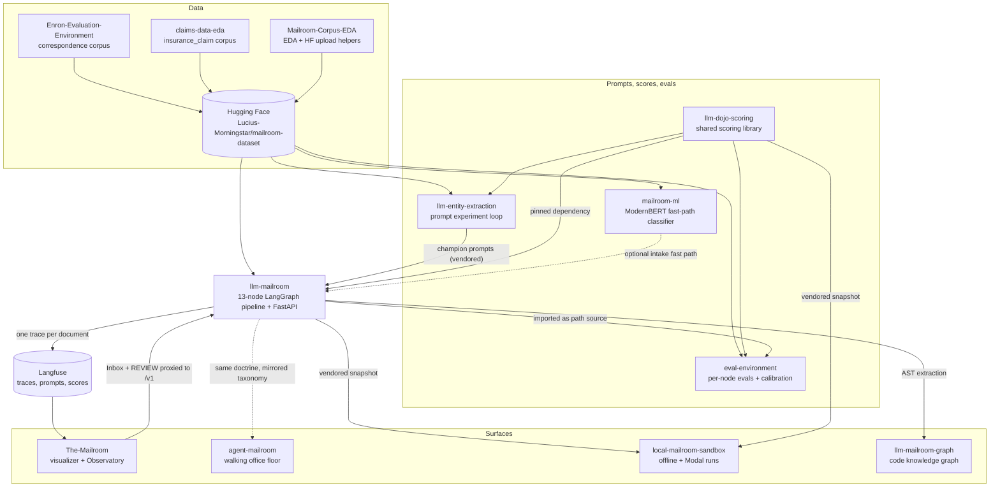
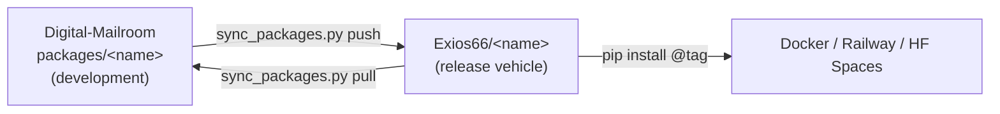

# The constellation

This page explains what flows between the repositories. For the inside of the pipeline itself (nodes, routing, thresholds), see [Pipeline architecture](../pipeline-reference-llm-mailroom/architecture.md).

## The big picture

How to read the diagram: a solid arrow is a hard dependency or a data flow that the receiving repo cannot work without. A dotted arrow is optional or doctrinal: the ModernBERT fast path can be switched off, and agent-mailroom mirrors the pipeline's taxonomy by convention rather than by importing it. Labels on the arrows name the coupling mechanism (a pin, a vendored copy, a path source, a trace), which tells you what breaks, and how, when the upstream side changes.

All of these packages also live together in the [Digital-Mailroom](../repository-guides/repos/digital-mailroom.md) monorepo, which is where cross-repo changes are made. The diagram shows how the packages relate at runtime and release time, not where their code sits.

## The flows, one by one

### Data: from raw corpora to a pinned dataset

1. **Corpus feeds build class-specific samples.** Enron-Evaluation-Environment turns 517K Enron emails into a stratified, de-duplicated `correspondence` sample. claims-data-eda renders CMS Medicare claim events into plain-text EOB documents with ground truth for `insurance_claim`. Contracts (CUAD), merger agreements (MAUD) and corporate records (EDGAR S-1 exhibits) come from public legal corpora.
2. **Everything is published to one dataset.** The canonical corpus is [`Lucius-Morningstar/mailroom-dataset`](https://huggingface.co/datasets/Lucius-Morningstar/mailroom-dataset): 3,302 documents, five classes, 55 class-by-subclass strata. Mailroom-Corpus-EDA profiles it (phases P0 to P6) and owns the upload helpers. GitBook embeds those figures on [Mailroom dataset](../mailroom-dataset/mailroom-dataset.md) ([visualizations](../mailroom-dataset/visualizations.md)).
3. **Consumers pin a revision, never a live tip.** Every consumer pins a Hub revision: the published pin is `670e8bc6` (tag v9.2), while eval-environment, mailroom-ml, llm-mailroom 0.8.0 and the sandbox still read the predecessor tag v9.1 (commit `bc9eab28`, data commit `ed7576b6`) as of 2026-10-07. The labels sit in a separate `ground_truth` config joined to the blind `default` config on `filename`, so a model under test never sees its answers.

Details: [Data and corpora](data-and-corpora.md). Full dataset section: [Mailroom dataset](../mailroom-dataset/mailroom-dataset.md).

### Prompts: from experiment to production

1. **llm-entity-extraction** tests one prompt version at a time across models and logs every run to an append-only experiment log.
2. When a prompt wins, it is **vendored** into llm-mailroom (`langchain_agents/`) along with its full version lineage, so evaluations can pin the exact version.
3. **eval-environment** holds the frozen v1 prompt lineage (`mailroom-evals-v1`) and the GEPA mutation loop that proposes new candidates; mailroom-issues keeps the frozen v1 reference copies.
4. In production, each agent's prompt is managed in Langfuse as `mailroom-<agent_name>` with a `production` label, and every LLM call links the prompt version it used.

### Scoring: one definition of "correct"

`llm-dojo-scoring` is the only place metrics are defined. It scores fields by type (dates are normalized before comparison, names use Jaro-Winkler, lists use Hungarian matching, free text uses token F1) rather than exact-matching everything.

* llm-mailroom pins it as a git dependency and keeps the pin current with an auto-bump workflow (`.github/workflows/bump-dojo-scoring.yml`).
* llm-entity-extraction and eval-environment use it for their experiment scoring.
* local-mailroom-sandbox carries a vendored snapshot so it works offline.

### Runtime: from document to archive

The pipeline runs one LangGraph state machine per document: intake, classify (with retry and a second-opinion reviewer), extract (with retry, judge, arbiter and boss escalation), compile report, write catalog, archive. Files move through filesystem bins (`inbox → processing → classified → archive | review | failed`, where `classified/` holds classification/working artifacts when a run uses one). Two auxiliary flows sit outside the graph: the free-model Gmail triage lane and the post-archive relations clerk.

An optional **ModernBERT fast path** from mailroom-ml can run at intake (`MAILROOM_BERT_INTAKE`, off by default). It is fail-open: if the flag is off, the package is missing or the model errors, intake carries on with the deterministic clerk.

Full detail: [Pipeline architecture](../pipeline-reference-llm-mailroom/architecture.md) and [Agents](../pipeline-reference-llm-mailroom/agents.md).

### Observability: the trace contract

Every document produces one Langfuse trace named `document-pipeline`, with verb-first node spans (`classify-document`, `extract-fields`, ...), a session per matter (or per pilot run), and tags for environment and source.

**The-Mailroom** treats those traces as its only source of truth: nothing on its screens is invented. That creates a contract between the two repos. When the pipeline changes span names, node order, the agent roster, document classes, confidence thresholds or judge score names, The-Mailroom must update `mailroom_ui/pipeline_schema.py` and `mailroom_ui/trace_interpreter.py` in the same change window, or new spans render as "unknown".

The-Mailroom's Inbox and REVIEW desk call back into the pipeline API (`MAILROOM_PIPELINE_URL` + `MAILROOM_PIPELINE_TOKEN` + `/v1`) so operators can queue documents and resolve reviews without holding producer keys in the browser.

eval-environment deliberately does **not** trace to Langfuse; it uses Braintrust or a local Arize Phoenix sink so eval runs never mix with production traces.

### Code: monorepo and release repos

* Development happens in the monorepo. Cross-package imports resolve to workspace sources through `[tool.uv.sources]`.
* Each package keeps its published git pins in `pyproject.toml`, so `pip install .` inside a package directory still builds exactly what a release would.
* `scripts/sync_packages.py {status|pull|push|snapshot}` keeps the monorepo subtrees and the `Exios66/*` repositories reconciled.
* Workflows under nested `.github/` folders do not run inside the monorepo; only the hub's own workflows do.

## Dependency summary

| Consumer               | Depends on                                | How                                                                          |
| ---------------------- | ----------------------------------------- | ---------------------------------------------------------------------------- |
| llm-mailroom           | llm-dojo-scoring                          | git pin `@v0.19.1`, auto-bumped                                              |
| llm-mailroom           | mailroom-ml                               | optional, lazily imported at intake                                          |
| llm-entity-extraction  | llm-dojo-scoring                          | git pin `@v0.16.0` (workspace source in the monorepo)                        |
| eval-environment       | llm-mailroom (and dojo through it)        | editable path source to a sibling checkout, set in `[tool.uv.sources]`       |
| local-mailroom-sandbox | llm-mailroom, llm-dojo-scoring            | tracked snapshots under `vendor/`                                            |
| The-Mailroom           | llm-mailroom                              | Langfuse traces + HTTP API; optional `[pipeline]` extra pins a `main` commit |
| agent-mailroom         | llm-dojo-scoring; llm-mailroom (doctrine) | git pin `@v0.16.0`; mirrored taxonomy and producer API shape                 |
| llm-mailroom-graph     | llm-mailroom                              | rebuilt from source with graphify                                            |
