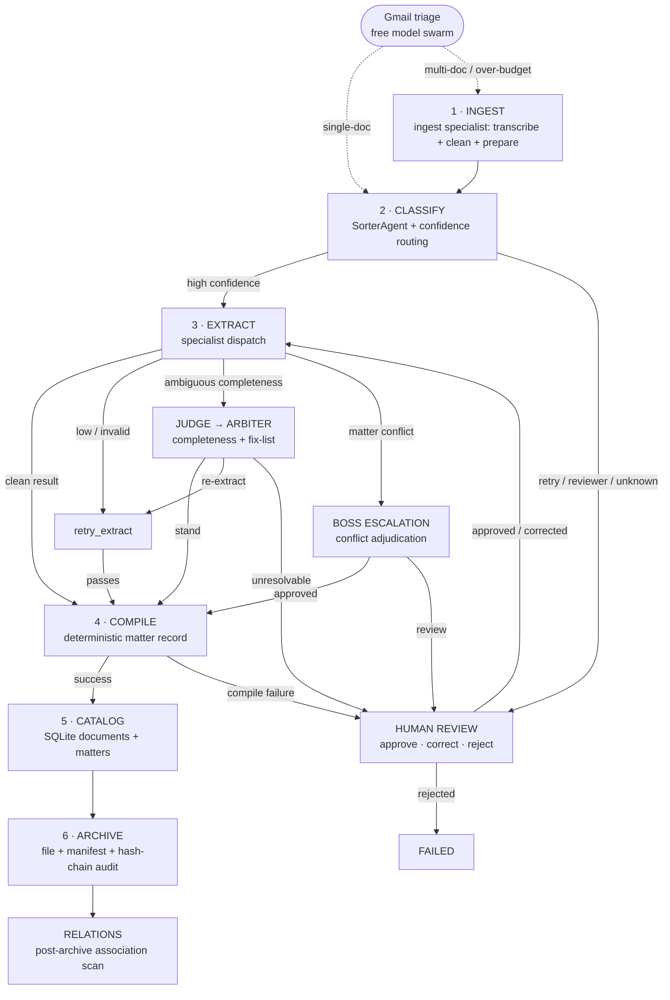

# Operational procedure

This page is the operator procedure for the Mailroom pipeline. Use it when you run the pipeline, resolve human reviews, or hand over a shift.

| You need to | Go to |
| --- | --- |
| Understand where a document can go | [1. Pipeline at a glance](#1-pipeline-at-a-glance) |
| Know why a document is in review | [Review triggers](#review-triggers) |
| Resolve a review item | [Operator review sequence](#operator-review-sequence) |
| Start or end a shift | [9. Routine operations checklist](#9-routine-operations-checklist) |
| Diagnose a stuck or failed document | [11. Symptoms and first checks](#11-symptoms-and-first-checks) |

Two rules govern every step on this page:

1. **The graph decides routes. The operator decides only at human review.** Do not move files between bins or edit catalog rows to force a result.
2. **Every decision is recorded.** The audit log keeps each automatic and human decision, so a later reader can reconstruct why a document ended where it did.

## 1. Pipeline at a glance

The Mailroom is a **13-node LangGraph state machine executed once per document**. Two auxiliary flows operate outside the graph: the Gmail triage lane (free model swarm for single-document emails) and the relations clerk (post-archive association scanning). Operationally, the graph nodes collapse into six phases:



### Six operator-visible phases

| Phase | Graph nodes | Operator meaning | Primary artifact |
| --------------- | ------------------------------------------------------------------------ | --------------------------------------------------------------------------------------------------------------------------------------------------- | ---------------------------- |
| **1. Intake** | `intake` | Claim file, ingest specialist transcribes PDFs/images, deterministic intake clerk normalizes text, gated LLM triage/clean/prepare, create manifest. | Manifest |
| **2. Classify** | `classify`, `retry_classify`, `review_classify` | Determine a live class and confidence; ambiguous/unknown results are not silently remapped. | Classification state + trace |
| **3. Extract** | `extract`, `retry_extract`, `judge_verify`, `arbiter`, `boss_escalation` | Dispatch specialist, validate output, resolve ambiguity, adjudicate conflicts. | Structured extraction |
| **4. Compile** | `compile_report` | Deterministically assemble the matter record. **No reporter LLM call.** | Matter record |
| **5. Catalog** | `catalog_write` | Persist document/matter metadata and extracted data. | SQLite/Postgres rows |
| **6. Archive** | `archive` | Move source, write manifest sidecar, append hash-chained audit entry. | Archived document + audit |

All **13** graph nodes appear above: the six phase rows account for `intake`, `classify`, `retry_classify`, `review_classify`, `extract`, `retry_extract`, `judge_verify`, `arbiter`, `boss_escalation`, `compile_report`, `catalog_write`, `archive` (12), plus **`human_review`** — the cross-cutting governance boundary that every phase can enter and that resumes into Extract. It has no phase of its own, so it is called out here rather than given a row; see [Human-review procedure](#4-human-review-procedure).

**Auxiliary flows (outside the graph):**

* **Gmail triage lane**: free OpenRouter model handles single-document Gmail uploads (classification + key extraction + archive) without paid agents. Multi-document emails and over-budget documents route to the full pipeline.
* **Relations clerk**: post-archive deterministic association scan (same-matter, keyword Jaccard, party overlap, embedding cosine) with optional LLM judgment for ambiguous near-misses.

The current design has two happy-path LLM generations: classification and extraction; report compilation is procedural. Source: [`agents/reporter.py`](https://github.com/Exios66/llm-mailroom/blob/main/src/agents/reporter.py) and the [Agents](agents.md) page.

## 2. Classification procedure

1. The API or the watcher puts the document in the inbox. The watcher claims it into `processing/` with an atomic move.
2. `intake` creates the manifest and normalizes the text with deterministic rules.
3. The Sorter assigns one live class: `contract`, `merger_agreement`, `corporate_record`, `correspondence`, or `insurance_claim`.
4. If the label is `unknown`, retired, empty, or unsupported, the document goes to human review. The pipeline does **not** change it to a nearby class.
5. The Sorter's confidence then selects the route. The table shows each route.

| Confidence after the first pass | Next step | If the retry gives the same band |
| --- | --- | --- |
| At or above `high` | Extract | Not applicable |
| From `low` up to `high` (medium band) | One re-classification pass (`retry_classify`) | The Lane A reviewer gives a second opinion. If the reviewer is not confident, the document goes to human review. |
| Below `low` | One re-classification pass | Human review |

The global defaults are `high = 0.97`, `low = 0.88` and `retry_max = 2`. The class-specific values in the next table replace them. Source: [`src/config/taxonomy.yaml`](https://github.com/Exios66/llm-mailroom/blob/main/src/config/taxonomy.yaml) (`confidence` and `retry` blocks); routes in [`src/graph/routing.py`](https://github.com/Exios66/llm-mailroom/blob/main/src/graph/routing.py) (`after_classify`, `after_retry_classify`).

Why a medium result is not accepted: a medium score usually means the document matches the form of one class and the topic of another. A second pass with a re-evaluation prompt often resolves this. A second, independent model resolves most of the remaining cases. A person sees only the cases that both models cannot resolve.

Provider errors (timeouts, rate limits, 5xx) do not use this retry budget. Each node retries a transient error on its own counter, and then sends the document to human review.

### Current class-specific thresholds

| Class | High | Low | Judge-band high |
| ------------------ | ---: | ---: | --------------: |
| `contract` | 0.98 | 0.90 | 0.97 |
| `merger_agreement` | 0.98 | 0.90 | 0.97 |
| `insurance_claim` | 0.98 | 0.90 | 0.97 |
| `corporate_record` | 0.96 | 0.86 | 0.94 |
| `correspondence` | 0.95 | 0.85 | 0.92 |

The thresholds increase with the cost of an error. A misfiled contract, merger agreement or claim has legal or financial results, so those classes need more confidence. A misfiled letter costs less, so `correspondence` accepts a lower score. To change a threshold, edit `src/config/taxonomy.yaml`. Do not put routing constants in code. For the effect of each change, see the [tuning guide](configuration.md#tuning-guide-what-moving-each-threshold-does). Source: [`src/config/taxonomy.yaml`](https://github.com/Exios66/llm-mailroom/blob/main/src/config/taxonomy.yaml).

## 3. Extraction procedure

1. Dispatch only to a specialist associated with a live taxonomy class.
2. Validate structured output against the document-type Pydantic schema.
3. Malformed/unsupported output enters the configured retry/review path.
4. Compare extraction confidence and expected-field coverage against configured gates.
5. A matter-level conflict routes to `boss_escalation`; conflicting source values are not silently resolved by recency or confidence.
6. An extraction in the configured ambiguous completeness band enters the Judge/Arbiter lane.

Current Judge/Arbiter controls include `arbiter_retry_max = 2` and `judge_max_passes = 3`. The Judge checks completeness; the Arbiter can stand the result, order re-extraction, or send the matter to human review. Source: [`src/config/taxonomy.yaml`](https://github.com/Exios66/llm-mailroom/blob/main/src/config/taxonomy.yaml) (`judge` / `arbiter` blocks).

The field scorer uses deterministic, type-aware matching and factuality verification. A field score in the global ambiguous band `[0.50, 0.85]` (inclusive) sets `needs_judge_review`. The scorer also defines per-type bands, but `score_extraction` does not apply them. Source: [llm-dojo-scoring `field_scoring.py` v0.21.0](https://github.com/Exios66/llm-dojo-scoring/blob/v0.21.0/llm_dojo_scoring/field_scoring.py); band table in [Configuration](configuration.md).

## 4. Human-review procedure

Human review is a **governance boundary**, not merely an error queue.

### Review triggers

* Unknown/retired/unsupported document class.
* Classification remains below its gate after retries.
* Lane A reviewer cannot establish a high-confidence live class.
* Extraction remains low-confidence after retry.
* Schema/guardrail failure cannot be repaired automatically.
* Judge/Arbiter declares an extraction incomplete or unresolvable.
* Boss escalation requires human review.
* Report compilation fails.

The review filesystem bin is the durable parking mechanism across process restarts; the in-memory LangGraph checkpoint is not assumed to survive a restart. Source: [`src/pipeline/watcher.py`](https://github.com/Exios66/llm-mailroom/blob/main/src/pipeline/watcher.py) and [`src/graph/routing.py`](https://github.com/Exios66/llm-mailroom/blob/main/src/graph/routing.py).

### Operator review sequence

**1 — Inspect.** Read the queue item (`GET /v1/review/queue`). The `escalation_reason` field gives the trigger, and `actions` lists the dispositions that the item accepts. Then examine the source document (`GET /v1/documents/{doc_id}/source`), the manifest, the classification and extraction evidence, and the trace or audit entries.

**2 — Decide.** Select one disposition:

| Decision | Use it when | Request body |
| --- | --- | --- |
| **Approve** | The current result is correct. | `decision=approved`, `disposition=resume`. The document is extracted again and continues. |
| **Correct classification** | The class is wrong. | `decision=approved`, `disposition=resume`, plus `override_doc_type` (and `doc_subclass` or `contract_subtype` if necessary). Extraction uses the new class. |
| **Correct the extraction** | You have the correct field values. | `decision=approved`, `disposition=complete`, plus `extracted_data`. The document is archived with your values and no further LLM call. |
| **Reject** | The document must not continue (for example, it is not a supported document). | `decision=rejected`, `disposition=resume`. The run stops in `failed/`. |

Two more dispositions exist for special cases. `record` writes the decision to the audit trail and leaves the file where it is. `requeue` copies the source back to the inbox for a new run.

**3 — Record the reason.** Put the reason for your decision in `notes`. The resolution goes into the audit trail, so each human decision can be examined later. Source: [`src/schemas/audit.py`](https://github.com/Exios66/llm-mailroom/blob/main/src/schemas/audit.py) and [`src/pipeline/review_resolve.py`](https://github.com/Exios66/llm-mailroom/blob/main/src/pipeline/review_resolve.py).

**4 — Send.** Send the decision with `POST /v1/review/{doc_id}/resolve` (JSON or form body). If the original checkpoint is not available (for example, after a restart), `resume_from_review` rebuilds the state from the manifest and the parked source.

## 5. Conflict adjudication

A conflict occurs when a new extraction disagrees with data that the matter already holds. Example: a new contract gives a different governing law from the earlier contracts in the same matter. This is a **consistency problem**, not low confidence. Both values can have high confidence, and the newer value is not always correct. For this reason, the pipeline does not select a value by date or by confidence.

1. Detect the conflict against existing same-class matter fields.
2. Route to `boss_escalation`.
3. If approved, continue to report compilation with the resolved state.
4. If review is required, park in human review.
5. Preserve the conflict and resolution in manifest/audit/catalog records.

## 6. Catalog and archive procedure

After report assembly:

1. `catalog_write` persists document and matter records.
2. Monitor catalog failures as operational failures.
3. `archive` moves the source to `/archive/<matter_id>/<doc_type>/`.
4. Write the manifest sidecar JSON.
5. Append the hash-chained audit entry.
6. Mark the manifest `ARCHIVED`.

The architecture treats filesystem bins as human-legible state and SQLite/catalog plus the hash-chained audit log as durable records. Source: [`src/schemas/audit.py`](https://github.com/Exios66/llm-mailroom/blob/main/src/schemas/audit.py) and [`src/schemas/manifest.py`](https://github.com/Exios66/llm-mailroom/blob/main/src/schemas/manifest.py).

## 7. Operator API

| Endpoint | Use |
| ----------------------------------- | ---------------------------------- |
| `GET /v1/health` | API/watcher health |
| `POST /v1/upload` | Submit a document |
| `GET /v1/queue` | Inspect queued/in-flight documents |
| `GET /v1/review/queue` | Inspect human-review work |
| `POST /v1/review/{doc_id}/resolve` | Resolve a review item |
| `GET /v1/documents/{doc_id}/source` | Retrieve parked source |
| `GET /v1/status/{doc_id}` | Inspect one document |
| `GET /v1/matters/{matter_id}` | Inspect a matter |
| `GET /v1/audit/{doc_id}` | Inspect the audit trail |
| `GET /v1/ops/status` | Operational health/metrics |
| `POST /v1/ops/sweep` | Run ops sweep |
| `POST /v1/ops/resume` | Resume after an operational pause |

The repository API documentation identifies this `/v1` layout as the current interface. Source: the [API reference](api.md) on this site, and [`src/api/main.py`](https://github.com/Exios66/llm-mailroom/blob/main/src/api/main.py) upstream.

## 8. Filesystem bins

```
pipeline/
├── inbox/ # new work
├── processing/ # atomically claimed work
├── classified/ # classification/working artifacts when used
├── review/ # durable human-review parking
└── failed/ # terminal rejected/failed work

archive/ # successful durable archive
manifests/ # per-document manifests
```

Operators should not manually move live documents between bins to force state transitions; routing belongs to the graph. Source: [`src/graph/routing.py`](https://github.com/Exios66/llm-mailroom/blob/main/src/graph/routing.py).

## 9. Routine operations checklist

### Start of shift

* Confirm `/v1/health` is healthy and the watcher heartbeat is current.
* Confirm the configured LLM provider/model mappings are reachable.
* Check `/v1/ops/status` for stalled processing, review backlog, and first-pass metrics.
* Inspect the review queue before accepting new workload.

### During processing

* Do not bypass the graph by editing catalog rows manually.
* Treat review decisions as explicit governance actions and record rationale.
* Investigate repeated retries/review loops rather than blindly rerunning.
* Use traces/audit entries to distinguish provider failures from model-quality failures.

### End of shift / handoff

* Ensure no unexplained files remain in `processing/`.
* Hand off outstanding reviews with document ID, matter ID, trigger, evidence inspected, and next action.
* Verify archived documents have manifests and audit entries.
* Record provider outages, model changes, threshold changes, or operational pauses.

## 10. Failure-handling rules

1. **Unknown means review.** Never silently coerce unknown classes.
2. **Confidence is routing evidence, not proof.** Acceptance also depends on deterministic guards and source evidence.
3. **Conflicts require adjudication.** Do not resolve by recency alone.
4. **Audit everything.** Human and terminal decisions must remain reconstructable.
5. **Do not assume checkpoints survive restart.** Review bin + manifest are the durable recovery path. Source: [`src/pipeline/watcher.py`](https://github.com/Exios66/llm-mailroom/blob/main/src/pipeline/watcher.py).
6. **Keep operational knobs in `src/config/taxonomy.yaml`.** Source: [`src/config/taxonomy.yaml`](https://github.com/Exios66/llm-mailroom/blob/main/src/config/taxonomy.yaml).

## 11. Symptoms and first checks

| Symptom | First check | Next action |
| --- | --- | --- |
| Files stay in `inbox/` | `GET /v1/health`: is `checks.watcher` `live`? | If `stale` or `missing`, restart the API (it includes the watcher) or the dedicated watcher. |
| A file stays in `processing/` | The trace and the watcher logs for that `doc_id` | Find the last node that completed. Do not move the file by hand. |
| The review queue grows fast | The trigger of each new item | If most items have one trigger (for example, one class under its gate), examine the model or the threshold. Do not approve them as a group. |
| Many transient-error reviews | The provider status and the trace errors | Fix the provider or the gateway, then resolve the items. They are provider failures, not quality failures. |
| `GET /v1/audit/{doc_id}` reports `"chain_valid": false` | The backup dates of the catalog DB and the manifests | Restore all three artifacts from the same point in time. See "Backup & Restore" on the [Deployment](deployment/README.md) page. |

## Visual reference

See [`assets/mailroom-pipeline.svg`](https://github.com/Exios66/llm-mailroom/tree/main/docs/assets/mailroom-pipeline.svg) for the operations-facing visualization. It groups the 13 implementation nodes into six operator-visible phases while retaining the human-review, Judge/Arbiter, and Boss escalation lanes.
