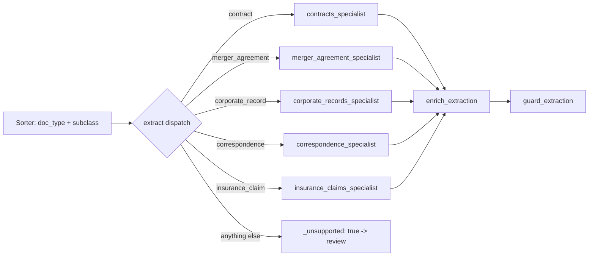
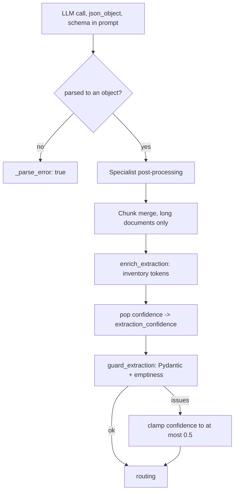

# Extraction schemas

This page lists exactly what the pipeline extracts from each document class, taken from the code. It covers:

* the five document classes and the specialist that handles each one;
* the fields each specialist returns, with types and meaning;
* the fields every extraction carries no matter the class (confidence, reasoning trace, pipeline metadata);
* what happens to an extraction between the LLM call and the guardrail (normalization, merging, enrichment);
* how the CUAD and MAUD label sets map into the contract and merger-agreement fields.

For the thresholds and model settings in `taxonomy.yaml`, see [Configuration](../pipeline-reference-llm-mailroom/configuration.md). For what each agent does and how it is prompted, see [Agents](../pipeline-reference-llm-mailroom/agents.md). This page does not repeat them.

## Find what you need

| If you are asking... | Go to |
| --- | --- |
| What does the specialist for class X return? | The class section: [Contract](#contract-contract), [Merger agreement](#merger-agreement-merger_agreement), [Corporate record](#corporate-record-corporate_record), [Correspondence](#correspondence-correspondence), [Insurance claim](#insurance-claim-insurance_claim) |
| What else is in `extracted_data` besides the class fields? | [The common envelope](#the-common-envelope) |
| Why does a field differ from what the model returned? | [How normalization works](#how-normalization-works) |
| Why was my extraction flagged or clamped to low confidence? | the guardrail step of [How normalization works](#how-normalization-works) and [Known gaps](#known-gaps-in-the-current-code) |
| Where do the clause and question lists come from? | [CUAD and MAUD label sets](#cuad-and-maud-label-sets) |

## Two definitions of every schema

Each class is defined twice in the code. You need to know both.

| Definition                                        | File                                                                                                                                                                      | Used for                                                                                                                                                                                                |
| ------------------------------------------------- | ------------------------------------------------------------------------------------------------------------------------------------------------------------------------- | ------------------------------------------------------------------------------------------------------------------------------------------------------------------------------------------------------- |
| Pydantic model (for example `ContractExtraction`) | [`src/schemas/documents.py`](https://github.com/Exios66/llm-mailroom/blob/main/src/schemas/documents.py), registry `EXTRACTION_SCHEMAS`                                   | Validation. The extraction guardrail calls `model_validate` on the extraction (`observability/scores.py:validate_extraction`). The Gmail triage lane also clamps its key-entity output to these models. |
| JSON schema (for example `CONTRACTS_SCHEMA`)      | [`src/langchain_agents/specialist_agents.py`](https://github.com/Exios66/llm-mailroom/blob/main/src/langchain_agents/specialist_agents.py), registry `SPECIALIST_SCHEMAS` | Sent to the model. `_call_structured` embeds it in the user message and asks for a `json_object` response. It also drives `normalize_extraction`.                                                       |

The split is deliberate: **ask for everything, accept less.** The model is shown a strict contract so it is prompted to address every field, including the ones where the honest answer is `null`. The validator is lenient so that a partly filled answer degrades into a lower-confidence extraction that the routing rules can retry or send to review, rather than crashing the run.

The JSON schemas are built with `build_structured_schema`, which marks **every property as required** and sets `additionalProperties: false`. So the model is always asked for every key. The Pydantic models give **every field a default**, so validation accepts a payload with keys missing. In the field tables below, "Default" is the Pydantic default.

The two definitions agree on field **types**: every money field is a nullable number in both. The remaining asymmetry is `confidence`, and it points in both directions — it is in the contract and merger **JSON schemas** but absent from `ContractExtraction`, while `CorrespondenceExtraction` and `InsuranceClaimExtraction` carry a `float` default that their JSON schemas never ask for. `CorporateRecordExtraction` has no `confidence` in either.

## Taxonomy overview

The classes come from `doc_classes` in [`src/config/taxonomy.yaml`](https://github.com/Exios66/llm-mailroom/blob/main/src/config/taxonomy.yaml). The extract node dispatches each class to its specialist through `graph/build_graph.py:_specialist_extractor_map`; the keys must match the taxonomy `specialist:` values or the graph refuses to build.

| Class key          | Label                | Pydantic schema             | Specialist (`agents/`)                                                                 | Prompt base                                                            |
| ------------------ | -------------------- | --------------------------- | -------------------------------------------------------------------------------------- | ---------------------------------------------------------------------- |
| `contract`         | Contract / Agreement | `ContractExtraction`        | `contracts_specialist.py` (subclasses the vendored LangChain `ContractsSpecialist`)    | Frozen v1 (`llm/frozen_v1/contracts_specialist.txt`), Langfuse-managed |
| `merger_agreement` | Merger Agreement     | `MergerAgreementExtraction` | `merger_agreement_specialist.py` (subclasses the vendored `MergerAgreementSpecialist`) | Frozen v1, Langfuse-managed                                            |
| `corporate_record` | Corporate Record     | `CorporateRecordExtraction` | `corporate_records_specialist.py` (mailroom `BaseAgent`)                               | Frozen v1, Langfuse-managed                                            |
| `correspondence`   | Correspondence       | `CorrespondenceExtraction`  | `correspondence_specialist.py` (mailroom `BaseAgent`)                                  | Frozen v1, Langfuse-managed                                            |
| `insurance_claim`  | Insurance Claim      | `InsuranceClaimExtraction`  | `insurance_claims_specialist.py` (mailroom `BaseAgent`)                                | Frozen v1, Langfuse-managed                                            |

Notes:

* `merger_agreement` (MAUD) and `contract` (CUAD) are separate live classes, not aliases. `pipeline/config.py:EXTRACT_CLASS_ALIASES` is currently empty, so only these five keys can be extracted. Any other label (for example `unknown`) gets no specialist; the extract node writes `{"_unsupported": true}` and parks the document for review.
* Per-class confidence thresholds (`confidence.by_class`) and per-specialist model budgets are in `taxonomy.yaml`; see [Configuration](../pipeline-reference-llm-mailroom/configuration.md).
* The "Scoring type" column in the tables below is the `field_types` entry for that field in `taxonomy.yaml`. It tells the deterministic field scorer how to compare the field to ground truth (see [Scoring and performance](scoring-and-metrics.md)).



## Contract (`contract`)

CUAD commercial contracts. The schema is the "pared CUAD product": key entities plus the fixed 41-category CUAD checklist. The code comment says open-ended `key_obligations` / `termination_clauses` are no longer extracted.

| Field                  | Pydantic type (default)   | Sent to model as                                                      | Scoring type            | Description (from schema)                                                                                      |
| ---------------------- | ------------------------- | --------------------------------------------------------------------- | ----------------------- | -------------------------------------------------------------------------------------------------------------- |
| `document_name`        | `str \| None` (None)      | string or null                                                        | `name`                  | The name of the contract (e.g. "Web Hosting Agreement").                                                       |
| `parties`              | `list[str]` (\[])         | array of string                                                       | `entity_list:name`      | The names of the contracting parties.                                                                          |
| `effective_date`       | `str \| None` (None)      | string or null                                                        | `date`                  | `YYYY-MM-DD` (ISO).                                                                                            |
| `term_length`          | `str \| None` (None)      | string or null                                                        | `free_text`             | The full duration or term of the agreement, including any riders.                                              |
| `governing_law`        | `str \| None` (None)      | string or null                                                        | `name`                  | The jurisdiction whose laws govern the agreement (governing-law sentence only).                                |
| `contract_value`       | `str \| None` (None)      | string or null                                                        | `money`                 | The monetary value or consideration.                                                                           |
| `renewal_terms`        | `str \| None` (None)      | string or null                                                        | `free_text`             | Renewal, extension, or rollover terms (automatic or otherwise).                                                |
| `cuad_family`          | `str \| None` (None)      | string or null                                                        | `name`                  | CUAD agreement family key (see [CUAD and MAUD](extraction-schemas.md#cuad-and-maud-label-sets)).               |
| `merger_consideration` | `str \| None` (None)      | string or null                                                        | `name`                  | MAUD consideration token. Null when the document is not a merger. Kept nullable so older payloads still parse. |
| `cuad_clauses`         | `list[str]` (\[])         | array of string                                                       | `entity_list:free_text` | Present CUAD categories as `"<Category>: <short verbatim evidence span>"`. Absent categories omitted.          |
| `maud_clauses`         | `list[str]` (\[])         | array of string                                                       | `entity_list:free_text` | Answered MAUD questions as `"<Question>: <Answer>"`. Empty unless the document is a merger agreement.          |
| `reasoning`            | `dict \| None` (None)     | object (see [Reasoning trace](extraction-schemas.md#reasoning-trace)) | not scored              | Per-field reasoning trace.                                                                                     |
| `confidence`           | not in the Pydantic model | number, 0.0 to 1.0                                                    | not scored              | Evidence-grounded extraction confidence.                                                                       |

```json
{
  "reasoning": {"summary": "<string>", "entries": [{"field": "<string>", "evidence": "<string>", "section_ref": "<string or null>"}]},
  "document_name": "<string or null>",
  "parties": ["<string>"],
  "effective_date": "<YYYY-MM-DD or null>",
  "term_length": "<string or null>",
  "governing_law": "<string or null>",
  "contract_value": "<string or null>",
  "renewal_terms": "<string or null>",
  "cuad_family": "<CUAD family key or null>",
  "merger_consideration": "<MAUD consideration token or null>",
  "cuad_clauses": ["<Category>: <evidence>"],
  "maud_clauses": ["<Question>: <Answer>"],
  "confidence": "<number 0.0-1.0>"
}
```

## Merger agreement (`merger_agreement`)

MAUD merger agreements ("Agreement and Plan of Merger"), a separate class with its own schema (v0). The prompt tells the model not to emit `cuad_family` or `cuad_clauses`, and enrichment removes them if it does.

| Field                  | Pydantic type (default) | Sent to model as   | Scoring type            | Description (from schema and prompt)                                                                                                        |
| ---------------------- | ----------------------- | ------------------ | ----------------------- | ------------------------------------------------------------------------------------------------------------------------------------------- |
| `document_name`        | `str \| None` (None)    | string or null     | `name`                  | The name of the merger agreement.                                                                                                           |
| `parties`              | `list[str]` (\[])       | array of string    | `entity_list:name`      | Parent, Merger Sub and Target (and any other contracting entity) as stated.                                                                 |
| `effective_date`       | `str \| None` (None)    | string or null     | `date`                  | Effective Date as `YYYY-MM-DD` when a calendar date is stated; null when only a defined-term Effective Time exists.                         |
| `effective_time`       | `str \| None` (None)    | string or null     | `free_text`             | Effective Time as written (clock time, time zone, or defined-term reference).                                                               |
| `governing_law`        | `str \| None` (None)    | string or null     | `name`                  | Governing-law sentence only.                                                                                                                |
| `merger_consideration` | `str \| None` (None)    | string or null     | `name`                  | Exactly one of `all_cash`, `all_stock`, `mixed_cash_stock`, `mixed_cash_stock_election`, `other`.                                           |
| `maud_clauses`         | `list[str]` (\[])       | array of string    | `entity_list:free_text` | Answered MAUD questions as `"<Question>: <Answer>"`, exact LegalBench names; Answer is the Hub `valid_class`. Unanswered questions omitted. |
| `intent`               | `str \| None` (None)    | string or null     | `name`                  | One short purpose label, e.g. `effect_merger`, `amend_merger`, `plan_of_merger`.                                                            |
| `subject_matter`       | `str \| None` (None)    | string or null     | `free_text`             | One tight grounded sentence about the agreement.                                                                                            |
| `keywords`             | `list[str]` (\[])       | array of string    | `entity_list:name`      | Up to 8 salient grounded terms.                                                                                                             |
| `confidence`           | `float` (0.0)           | number, 0.0 to 1.0 | not scored              | Evidence-grounded extraction confidence.                                                                                                    |
| `reasoning`            | `dict \| None` (None)   | object             | not scored              | Per-field reasoning trace.                                                                                                                  |

```json
{
  "reasoning": {"summary": "<string>", "entries": [{"field": "<string>", "evidence": "<string>", "section_ref": "<string or null>"}]},
  "document_name": "<string or null>",
  "parties": ["<string>"],
  "effective_date": "<YYYY-MM-DD or null>",
  "effective_time": "<string or null>",
  "governing_law": "<string or null>",
  "merger_consideration": "<all_cash | all_stock | mixed_cash_stock | mixed_cash_stock_election | other>",
  "maud_clauses": ["<Question>: <Answer>"],
  "intent": "<string or null>",
  "subject_matter": "<string or null>",
  "keywords": ["<string>"],
  "confidence": "<number 0.0-1.0>"
}
```

## Corporate record (`corporate_record`)

Bylaws, articles or certificates of incorporation, powers of attorney, stockholder rights instruments and specimen stock (including SEC exhibits).

| Field            | Pydantic type (default) | Sent to model as | Scoring type       | Description (from schema and prompt)                                                                                                               |
| ---------------- | ----------------------- | ---------------- | ------------------ | -------------------------------------------------------------------------------------------------------------------------------------------------- |
| `entity_name`    | `str` ("")              | string or null   | `name`             | Legal entity name as stated; no abbreviation unless the document abbreviates.                                                                      |
| `record_type`    | `str` ("")              | string or null   | `name`             | Exactly one of `articles_of_incorporation`, `bylaws`, `powers_of_attorney`, `rights_instrument`, `other`. Never an SEC form type (S-1, 10-K, 8-K). |
| `effective_date` | `str \| None` (None)    | string or null   | `date`             | Date the record took effect (ISO or as written).                                                                                                   |
| `signatories`    | `list[str]` (\[])       | array of string  | `entity_list:name` | Individuals who signed or approved.                                                                                                                |
| `jurisdiction`   | `str \| None` (None)    | string or null   | `name`             | State or country of incorporation.                                                                                                                 |
| `filing_number`  | `str \| None` (None)    | string or null   | `id`               | Official filing or document reference number, transcribed exactly.                                                                                 |
| `intent`         | `str \| None` (None)    | string or null   | `name`             | One controlled Hub purpose label: `governance_rules`, `corporate_action_approval`, `entity_formation`, `authority_delegation`, `investor_rights`, `other`. |
| `subject_matter` | `str \| None` (None)    | string or null   | `free_text`        | One tight grounded sentence about the record.                                                                                                      |
| `keywords`       | `list[str]` (\[])       | array of string  | `entity_list:name` | Up to 8 salient grounded terms.                                                                                                                    |

The JSON schema and the Pydantic model have no `confidence` field for this class. The prompt still asks for an evidence-derived `confidence`, so it appears only if the model follows that rule.

```json
{
  "entity_name": "<string>",
  "record_type": "<articles_of_incorporation | bylaws | powers_of_attorney | rights_instrument | other>",
  "effective_date": "<string or null>",
  "signatories": ["<string>"],
  "jurisdiction": "<string or null>",
  "filing_number": "<string or null>",
  "intent": "<string or null>",
  "subject_matter": "<string or null>",
  "keywords": ["<string>"]
}
```

## Correspondence (`correspondence`)

Letters, emails, memos, notices, demand letters, press releases and meeting requests.

| Field                   | Pydantic type (default) | Sent to model as       | Scoring type       | Description (from schema and prompt)                                                                                                       |
| ----------------------- | ----------------------- | ---------------------- | ------------------ | ------------------------------------------------------------------------------------------------------------------------------------------ |
| `sender`                | `str \| None` (None)    | string or null         | `name`             | Who sent the communication. For press releases, the issuing company or media-contact line.                                                 |
| `recipient`             | `str \| None` (None)    | string or null         | `name`             | Who received it. Null for press releases with no named addressee.                                                                          |
| `additional_recipients` | `list[str]` (\[])       | array of string        | `entity_list`      | Cc'd or otherwise copied parties.                                                                                                          |
| `communication_type`    | `str` ("")              | string or null         | `name`             | Exactly one of `email`, `letter`, `memo`, `notice`, `demand`, `attorney_demand`, `press_release`, `meeting_request`.                       |
| `communication_date`    | `str \| None` (None)    | string or null         | `date`             | Date the communication was sent, not a referenced deadline.                                                                                |
| `demand_amount`         | `float \| None` (None)  | number or null         | `money`            | Exact dollar amount demanded, as a number (prompt example: `218440.00`). Null when nothing is demanded.                                    |
| `action_items`          | `list[str]` (\[])       | array of string        | `entity_list`      | At most 3 concrete actions, with deadlines if stated.                                                                                      |
| `urgency`               | `str` ("")              | string or null         | `name`             | `routine`, `time-sensitive`, `urgent` or `critical`. Neutral defaults to `routine`.                                                        |
| `intent`                | `str \| None` (None)    | string or null         | `name`             | One controlled Hub purpose label: `payment_demand`, `notice`, `analysis`, `request`, `update`, `meeting_invite`, `press_communication`, `other`. |
| `subject_matter`        | `str \| None` (None)    | string or null         | `free_text`        | One tight grounded sentence about the communication.                                                                                       |
| `keywords`              | `list[str]` (\[])       | array of string        | `entity_list:name` | Up to 8 salient grounded terms.                                                                                                            |
| `confidence`            | `float` (0.0)           | not in the JSON schema | not scored         | Asked for by the prompt only.                                                                                                              |

`demand_amount` is a nullable number in both the JSON schema and the Pydantic model, so the model is asked for a number and the guardrail validates it without a type disagreement. An unstated amount stays `null` — it is never coerced into a stated `0`.

```json
{
  "sender": "<string or null>",
  "recipient": "<string or null>",
  "additional_recipients": ["<string>"],
  "communication_type": "<email | letter | memo | notice | demand | attorney_demand | press_release | meeting_request>",
  "communication_date": "<string or null>",
  "demand_amount": "<number or null>",
  "action_items": ["<string>"],
  "urgency": "<routine | time-sensitive | urgent | critical>",
  "intent": "<string or null>",
  "subject_matter": "<string or null>",
  "keywords": ["<string>"]
}
```

## Insurance claim (`insurance_claim`)

FNOL forms, adjuster reports, demand packages, coverage determinations, denial letters, CMS/DE-SynPUF claim tables (inpatient, outpatient, PDE, carrier) and the v8 synthetic lines of business.

| Field                    | Pydantic type (default) | Sent to model as       | Scoring type            | Description (from schema and prompt)                                                                                                                                                                                                                       |
| ------------------------ | ----------------------- | ---------------------- | ----------------------- | ---------------------------------------------------------------------------------------------------------------------------------------------------------------------------------------------------------------------------------------------------------- |
| `claim_number`           | `str \| None` (None)    | string or null         | `id`                    | Claim number exactly as printed (CLAIM NO., FNOL ref., CLM\_ID). On CMS Medicare Summary Notices, Notice ID.                                                                                                                                               |
| `policy_number`          | `str \| None` (None)    | string or null         | `id`                    | Policy number exactly as printed.                                                                                                                                                                                                                          |
| `insurer`                | `str` ("")              | string or null         | `name`                  | Named insurance company or carrier.                                                                                                                                                                                                                        |
| `insured_party`          | `str` ("")              | string or null         | `name`                  | Named insured or claimant.                                                                                                                                                                                                                                 |
| `claim_type`             | `str` ("")              | string or null         | `name`                  | CMS tables: `pde`, `inpatient`, `outpatient`, `carrier`. FNOL/policy documents: `auto`, `property`, `liability`, `health`, `life`, `workers_comp`. `other` only when none fit.                                                                             |
| `date_of_loss`           | `str \| None` (None)    | string or null         | `date`                  | Date the loss or event occurred.                                                                                                                                                                                                                           |
| `date_filed`             | `str \| None` (None)    | string or null         | `date`                  | Date the claim was filed.                                                                                                                                                                                                                                  |
| `claimed_amount`         | `float \| None` (None)  | number or null         | `money`                 | Amount claimed or demanded. `0` is a stated amount.                                                                                                                                                                                                        |
| `adjuster`               | `str \| None` (None)    | string or null         | `name`                  | Named adjuster, null when absent (CMS rows often have none).                                                                                                                                                                                               |
| `damages_description`    | `str` ("")              | string or null         | `free_text`             | Summary of the loss or damages as described.                                                                                                                                                                                                               |
| `coverage_determination` | `str` ("")              | string or null         | `name`                  | Outcome as stated: `approved`, `denied`, `partial`, `pending`.                                                                                                                                                                                             |
| `denial_reasons`         | `list[str]` (\[])       | array of string        | `entity_list:free_text` | Stated denial or limitation grounds. Empty when approved.                                                                                                                                                                                                  |
| `supporting_documents`   | `list[str]` (\[])       | array of string        | `entity_list`           | Referenced supporting documents.                                                                                                                                                                                                                           |
| `intent`                 | `str \| None` (None)    | string or null         | `name`                  | One controlled Hub purpose label: `claim_filing`, `coverage_determination`, `loss_report`, `claim_data_record`, `other`. Each is defined in the field description the schema sends.                                                                                                  |
| `subject_matter`         | `str \| None` (None)    | string or null         | `free_text`             | One tight grounded sentence about the claim document.                                                                                                                                                                                                      |
| `keywords`               | `list[str]` (\[])       | array of string        | `entity_list:name`      | Up to 8 salient grounded terms.                                                                                                                                                                                                                            |
| `claim_checklist`        | `list[str]` (\[])       | array of string        | `entity_list:free_text` | Present-only answers as `"<Category>: <short evidence>"`. Categories: Coverage Determination, Policy Limits, Exclusions Cited, Deductible, Reservation Of Rights, Timely Notice, Proof Of Loss, Subrogation, Independent Medical Exam, Amount Consistency. |
| `confidence`             | `float` (0.0)           | not in the JSON schema | not scored              | Asked for by the prompt only.                                                                                                                                                                                                                              |

```json
{
  "claim_number": "<string or null>",
  "policy_number": "<string or null>",
  "insurer": "<string>",
  "insured_party": "<string>",
  "claim_type": "<pde | inpatient | outpatient | carrier | auto | property | liability | health | life | workers_comp | other>",
  "date_of_loss": "<string or null>",
  "date_filed": "<string or null>",
  "claimed_amount": "<number or null>",
  "adjuster": "<string or null>",
  "damages_description": "<string>",
  "coverage_determination": "<approved | denied | partial | pending>",
  "denial_reasons": ["<string>"],
  "supporting_documents": ["<string>"],
  "intent": "<string or null>",
  "subject_matter": "<string or null>",
  "keywords": ["<string>"],
  "claim_checklist": ["<Category>: <evidence>"]
}
```

## The common envelope

There is no single wrapper model around extractions. What every extraction shares is a set of extra keys, added by the specialist or by the graph, plus the routing fields on the manifest.

### Keys inside `extracted_data`

| Key            | Where it comes from                                             | Meaning                                                                                                                                                                                                                                                                       |
| -------------- | --------------------------------------------------------------- | ----------------------------------------------------------------------------------------------------------------------------------------------------------------------------------------------------------------------------------------------------------------------------- |
| `confidence`   | The model (contract and merger: filled in by code when missing) | 0.0 to 1.0, evidence-based. The extract node **pops it out** of the payload and stores it as `extraction_confidence`, so it is not in the stored `extracted_data`.                                                                                                            |
| `reasoning`    | The model (contract and merger schemas only)                    | Per-field trace. See below.                                                                                                                                                                                                                                                   |
| `_parse_error` | Specialist or extract node                                      | `true` when the model reply was not a JSON object, or the specialist raised. The mailroom `BaseAgent` specialists also return `confidence: 0.3` with it.                                                                                                                      |
| `_raw`         | `agents/base.py:_call_structured`                               | Raw model text on a parse failure (inside the specialist only; the specialist returns `{"confidence": 0.3, "_parse_error": true}`).                                                                                                                                           |
| `_exception`   | Extract node                                                    | Exception text when the specialist raised a non-transient error.                                                                                                                                                                                                              |
| `_unsupported` | Extract node                                                    | `true` when no specialist exists for the `doc_type`.                                                                                                                                                                                                                          |
| `_report`      | `compile_report` node                                           | The procedural matter record from `agents/reporter.py:compile_matter_record`: `summary`, `doc_type`, `contract_subtype`, `doc_subclass`, `extracted_data` (without `confidence`, `reasoning`, `_report`), `classification_confidence`, `extraction_confidence`, `procedural`. |

Keys that start with `_`, plus `reasoning` and `confidence`, are not counted as content by the guardrail's emptiness check (`pipeline/guards.py:_has_substantive_content`).

### Reasoning trace

Only the contract and merger-agreement JSON schemas ask for it. Shape (from the schema):

```json
{
  "summary": "<string>",
  "entries": [
    {"field": "<string>", "evidence": "<string>", "section_ref": "<string or null>"}
  ]
}
```

`field` and `evidence` are required in each entry. The schema description says it explains how each value was found and is never clause content. The `ContractExtraction` comment says it is excluded from scoring, judge input and the client-facing report; the reporter drops it from `_report`.

There is no separate `citations` or `provenance` field in any extraction schema. Evidence lives in `reasoning.entries[].evidence` / `section_ref` (contract, merger) and in the `"<Category>: <evidence>"` lines of `cuad_clauses`, `maud_clauses` and `claim_checklist`. Document provenance (intake source, hashes, audit chain) is recorded outside the extraction, on the manifest and in the audit log.

### Manifest and state fields around the extraction

`DocumentManifest` in [`src/schemas/manifest.py`](https://github.com/Exios66/llm-mailroom/blob/main/src/schemas/manifest.py) stores the extraction with these related fields:

| Field                                                                                                      | Type            | Meaning                                                     |
| ---------------------------------------------------------------------------------------------------------- | --------------- | ----------------------------------------------------------- |
| `doc_type`                                                                                                 | `str \| None`   | Class key from the sorter.                                  |
| `contract_subtype`                                                                                         | `str \| None`   | CUAD family (contracts only).                               |
| `doc_subclass`                                                                                             | `str \| None`   | Subclass token from the sorter catalog.                     |
| `extracted_data`                                                                                           | `dict \| None`  | The extraction payload described on this page.              |
| `extraction_confidence`                                                                                    | `float \| None` | The popped `confidence`, after the guardrail clamp.         |
| `extraction_attempts`                                                                                      | `int`           | Number of extract runs.                                     |
| `judge_verdict`, `judge_score`, `judge_findings`                                                           |                 | Lane B judge result, when it ran.                           |
| `arbiter_decision`, `arbiter_reasoning`, `arbiter_handoff`, `arbiter_fields_to_fix`, `arbiter_retry_count` |                 | Lane B arbiter result, when it ran.                         |
| `intake`                                                                                                   | `dict \| None`  | Intake provenance (`source`, message id, sender and so on). |

The graph state also carries `extraction_guardrail`, the list of guardrail issues (`extraction_parse_error`, `extraction_schema_invalid`, `extraction_empty`, or `no_specialist_dispatch`). Each extract run writes an `extracted` audit event (`AuditLogEntry` in [`src/schemas/audit.py`](https://github.com/Exios66/llm-mailroom/blob/main/src/schemas/audit.py)) with `attempts`, `guardrail_issues` and `conflict_detected` in `detail`.

## How normalization works

An extraction goes through these steps between the LLM call and routing. The order matters.



### 1. Specialist post-processing

This differs by class.

| Class                                                               | Missing `confidence`                                                                                                                                                                                                                                                                       | Missing keys filled                                                                                                                                  | Extra step                                                                                                                                                                                                                                                                                                        |
| ------------------------------------------------------------------- | ------------------------------------------------------------------------------------------------------------------------------------------------------------------------------------------------------------------------------------------------------------------------------------------ | ---------------------------------------------------------------------------------------------------------------------------------------------------- | ----------------------------------------------------------------------------------------------------------------------------------------------------------------------------------------------------------------------------------------------------------------------------------------------------------------- |
| `contract`, `merger_agreement` (vendored `_SpecialistBase.extract`) | If `confidence` is missing or `0.0`, it is set to the share of schema fields found (`_evidence_confidence`). `confidence`, `reasoning`, `cuad_family`, `merger_consideration`, `cuad_clauses` and `maud_clauses` are left out of that count, because an empty inventory is a valid answer. | `normalize_extraction`: arrays to `[]`, numbers to `0.0`, other types to `null`.                                                                     | None.                                                                                                                                                                                                                                                                                                             |
| `correspondence`                                                    | Not filled.                                                                                                                                                                                                                                                                                | `normalize_specialist_extraction`: `normalize_extraction`, then `sender`, `recipient`, `communication_type` and `urgency` are set to `""` when null. | None.                                                                                                                                                                                                                                                                                                             |
| `insurance_claim`                                                   | Not filled.                                                                                                                                                                                                                                                                                | `normalize_specialist_extraction`: `normalize_extraction`.                                                                                           | Empty fields are filled from the source text by conservative regexes (`observability/posthoc_gt.py:extract_insurance_fields`, which reads the first 4000 characters for labels such as `Claim No.`, `Notice ID`, `Policy Number`, `Insurer`, `Insured`, `Adjuster`). A value from the model is never overwritten. |
| `corporate_record`                                                  | Not filled.                                                                                                                                                                                                                                                                                | Not filled.                                                                                                                                          | None.                                                                                                                                                                                                                                                                                                             |

The `normalize_extraction` rule lives in `langchain_agents/specialist_agents.py`; the per-class wrapper is [`src/pipeline/extraction_normalize.py`](https://github.com/Exios66/llm-mailroom/blob/main/src/pipeline/extraction_normalize.py).

### 2. Chunk merge (long documents)

When `chunking.enabled` is true and a document is longer than one window, the specialist extracts each overlapping window separately and merges the results (`_SpecialistBase._merge_extractions`):

* list fields: union, with case- and whitespace-insensitive dedupe;
* scalar fields: the first non-null value in document order wins;
* `confidence`: the maximum across windows;
* `reasoning`: entries dedupe by `field` (first witness wins) and summaries join in order.

A window that fails to parse is skipped. If every window fails, the result is `{"_parse_error": true}`. Window sizes come from `chunking.chunk_chars` and `chunking.overlap_chars`, capped by the specialist's `max_input_chars`; see [Configuration](../pipeline-reference-llm-mailroom/configuration.md).

### 3. Inventory enrichment

After the specialist returns, the extract node calls `langchain_agents/doc_inventories.py:enrich_extraction` with the sorter's subclass. It fills inventory fields without overwriting a specialist value, except to canonicalize a token:

| Class              | What enrichment does                                                                                                                                                                                                                                                                                                           |
| ------------------ | ------------------------------------------------------------------------------------------------------------------------------------------------------------------------------------------------------------------------------------------------------------------------------------------------------------------------------ |
| `contract`         | Coerces `cuad_clauses` and `maud_clauses` to `"<label>: <text>"` lines (`as_clause_lines`, which also accepts Hub-style dicts and dedupes). Fills an empty `cuad_family` from the sorter subtype (unless the subtype is `other`). Ensures `merger_consideration`, `cuad_family`, `cuad_clauses` and `maud_clauses` keys exist. |
| `merger_agreement` | Coerces `maud_clauses` to lines. Fills an empty `merger_consideration` by inference (`infer_merger_consideration`: from `merger_consideration`, `contract_value`, `document_name`, a `Type of Consideration:` line, then any clause text). Removes `cuad_family` and `cuad_clauses`.                                           |
| `corporate_record` | Maps `record_type` (or, if empty, the sorter subclass) onto a canonical token with `normalize_record_type`. Canonicalizes `intent` with `normalize_intent`.                                                                                                                                                           |
| `correspondence`   | Maps `communication_type` (or the subclass) with `normalize_communication_type`. Canonicalizes `intent` with `normalize_intent`.                                                                                                                                                                                              |
| `insurance_claim`  | Maps `claim_type` (or the subclass) with `normalize_claim_type`. Canonicalizes `intent` with `normalize_intent`.                                                                                                                                                                                                              |

The token mappers compact the value to lowercase letters and digits, then try an exact key, an exact alias, a long-alias prefix or substring match, and finally a key prefix or substring match. Unmapped values leave the field unchanged. Examples of aliases from the code: `poa` to `powers_of_attorney`, `memorandum` to `memo`, `workerscompensation` to `workers_comp`, `partd` to `pde`.

`normalize_intent` is the one mapper with a stricter contract. It maps a free-text `intent` onto the class's controlled vocabulary (`INTENT_LABELS`) and its result is **always a member of that class's own vocabulary** — an alias can no longer leak another class's token. Legacy labels map as you would expect: `demand_payment` to `payment_demand`, `coverage_denial` to `coverage_determination`, `record_governance` to `governance_rules`, `notice_of_loss` to `claim_filing`. It covers the three classes that have a Hub vocabulary at all — `corporate_record`, `correspondence` and `insurance_claim`; `contract` and `merger_agreement` keep their own `intent` tokens (`effect_merger`, `amend_merger`, `plan_of_merger`) and are not touched.


A label that does not map into the class's vocabulary is **left exactly as the model returned it** — the extract path overwrites `intent` only on a successful mapping. Because `payment_demand` is not a member of the insurance-claim vocabulary, an insurance specialist that still emits `demand_payment` keeps `demand_payment`. The prompt is the real defence here: `intent`'s schema description now enumerates the exact tokens for that class, so the model is no longer *offered* a label from another class's vocabulary in the first place.


The extract call also gets a matching instruction block in its handoff context (`specialist_handoff`), which lists the allowed tokens for the class, so the model is told the vocabulary before enrichment runs.

### 4. Guardrail

`pipeline/guards.py:guard_extraction` reports an issue when the payload has `_parse_error`, fails `model_validate` against the Pydantic schema, or has no populated field. Any issue clamps `extraction_confidence` to at most `0.5` (or `0.0` if there was none), so routing sends the document to retry or review. For `insurance_claim` it also logs determination-consistency issues, which are informational and do not change routing.

### Known gaps in the current code

These follow from the code as written. They are listed so a reader is not surprised.


**Status re-verified 2026-10-06** against the llm-mailroom working tree. Three of the five gaps that used to be listed here are fixed; two are open and are still in progress. See [Patched gaps](#patched-gaps-since-2026-10-06) for what changed.


* **Open — `insurance_claim` null strings.** `normalize_extraction` sets missing or null string fields to `null`, but `insurer`, `insured_party`, `claim_type`, `damages_description` and `coverage_determination` are non-nullable `str` in the Pydantic model. An extraction that leaves any of them null (and that the regex fill does not cover) fails validation, and the guard records `extraction_schema_invalid`. Re-verified on 2026-10-06: `normalize_specialist_extraction("insurance_claim", {"claim_number": "X"})` followed by `InsuranceClaimExtraction.model_validate` still raises exactly 5 errors, one per field.
* **Open — `corporate_record` null strings.** `entity_name` and `record_type` are non-nullable `str` in the Pydantic model, while the JSON schema allows null and no normalization step runs for this class. A null `entity_name`, or a null `record_type` that enrichment cannot fill from the subclass, fails validation. Re-verified on 2026-10-06: the same round trip raises 2 errors. The root cause is shared with the gap above — the `else` branch of `normalize_extraction` still writes `None` into any absent string field, and only `correspondence` has a per-class `""` fallback that avoids it.

#### Patched gaps since 2026-10-06

Three previously listed gaps are resolved. All three changes are in the llm-mailroom working tree and **not yet committed to `main`**, so the `blob/main/` links above do not yet show them; the prose describes the patched code.

* **Money-field type mismatch — fixed.** `demand_amount` and `claimed_amount` are now `["number", "null"]` in the request schemas, matching the Pydantic `float | None`, via a new `_nullable_number` helper. `normalize_extraction` learned to distinguish nullable from non-nullable numbers: an unstated amount now stays `null` instead of being coerced to a stated `0.0`, while `confidence` keeps its `0.0` default.
* **Prompt-doctrine drift — fixed.** The "Registered schema fields" lines in `llm/prompt_doctrine.py` now name the fields that actually exist. `CONTRACTS` drops `termination_clauses` and `key_obligations` and adds `reasoning`, `cuad_family`, `merger_consideration`, `cuad_clauses`, `maud_clauses` and `confidence`; `CORPORATE_RECORDS` drops `key_provisions` and adds `intent`, `subject_matter`, `keywords`; `CORRESPONDENCE` drops `key_points` and `referenced_communications` and adds the same three; `INSURANCE_CLAIMS` adds `intent`, `subject_matter`, `keywords` and `claim_checklist`.
* **`intent` label vocabulary — fixed at the prompt, hardened in code.** `intent`'s schema description is now generated from `INTENT_DESCRIPTIONS` and enumerates that class's exact tokens, so no class is offered another's labels any more. `normalize_intent` gained a class-membership guard (it returns `""` rather than a token from another class) plus the aliases `demandpayment`, `requestinformation`, `schedulemeeting` and `noticeofloss`, and `enrich_extraction` now calls it on the extract path — previously it was reached only from `scripts/sync_hf_ground_truth.py` and tests. The residual caveat is the hint under [Inventory enrichment](#3-inventory-enrichment): an unmapped label is left as the model returned it.

## Subclass inventories

Each class has a token set used by the sorter (`doc_subclass`) and, for three classes, by one extraction field. They are defined in [`src/langchain_agents/doc_inventories.py`](https://github.com/Exios66/llm-mailroom/blob/main/src/langchain_agents/doc_inventories.py) and [`src/langchain_agents/cuad_maud.py`](https://github.com/Exios66/llm-mailroom/blob/main/src/langchain_agents/cuad_maud.py).

| Class              | Extraction field       | Extraction tokens                                                                                                                                                                                                                                                                                                                                                            |
| ------------------ | ---------------------- | ---------------------------------------------------------------------------------------------------------------------------------------------------------------------------------------------------------------------------------------------------------------------------------------------------------------------------------------------------------------------------- |
| `contract`         | `cuad_family`          | 25 CUAD family keys: affiliate, agency, collaboration, co\_branding, consulting, development, distributor, endorsement, franchise, hosting, ip, joint\_venture, license, maintenance, manufacturing, marketing, non\_compete\_no\_solicit, outsourcing, promotion, reseller, service, sponsorship, strategic\_alliance, supply, transportation (plus `other` for the sorter) |
| `merger_agreement` | `merger_consideration` | all\_cash, all\_stock, mixed\_cash\_stock, mixed\_cash\_stock\_election, other                                                                                                                                                                                                                                                                                               |
| `corporate_record` | `record_type`          | articles\_of\_incorporation, bylaws, powers\_of\_attorney, rights\_instrument, other                                                                                                                                                                                                                                                                                         |
| `correspondence`   | `communication_type`   | email, letter, memo, notice, demand, attorney\_demand, press\_release, meeting\_request                                                                                                                                                                                                                                                                                      |
| `insurance_claim`  | `claim_type`           | pde, inpatient, outpatient, carrier, auto, property, liability, health, life, workers\_comp, other                                                                                                                                                                                                                                                                           |

The sorter catalog for `corporate_record` is wider than the extraction set. Its fallback list (used when `llm_dojo_scoring` is not installed) adds certificate\_of\_formation, charter\_amendment, board\_resolution, officer\_certificate, indenture and subsidiary\_list. The code comment says not to replace the narrower extraction set with it.

## CUAD and MAUD label sets

The contract and merger-agreement schemas flatten the Hub label sets of `Lucius-Morningstar/mailroom-dataset` (config `ground_truth`) into string lines, so chunk merging, field scoring and the ground-truth join share one shape.

| Hub ground-truth column         | Shape in the Hub                                                                 | Pipeline field                                            | Flattened by                 |
| ------------------------------- | -------------------------------------------------------------------------------- | --------------------------------------------------------- | ---------------------------- |
| `expected_subclass` (contracts) | CUAD family folder name, e.g. `License_Agreements`                               | `cuad_family`                                             | Sorter `normalize_subtype`   |
| `expected_subclass` (mergers)   | MAUD consideration                                                               | `merger_consideration`                                    | `normalize_consideration`    |
| `cuad_clause_labels`            | JSON object: 41 categories to `[{start, text}, ...]`; empty list means absent    | `cuad_clauses` as `"<Category>: <text>"`, present only    | `flatten_cuad_clause_labels` |
| `maud_clause_labels`            | JSON object: question to `{answer, category, excerpt_chars, valid_classes, ...}` | `maud_clauses` as `"<Question>: <answer>"`, answered only | `flatten_maud_clause_labels` |

**CUAD categories (41, Atticus CUAD v1 names):** Document Name, Parties, Agreement Date, Effective Date, Expiration Date, Renewal Term, Notice Period To Terminate Renewal, Governing Law, Most Favored Nation, Competitive Restriction Exception, Non-Compete, Exclusivity, No-Solicit Of Customers, No-Solicit Of Employees, Non-Disparagement, Termination For Convenience, Rofr/Rofo/Rofn, Change Of Control, Anti-Assignment, Revenue/Profit Sharing, Price Restrictions, Minimum Commitment, Volume Restriction, Ip Ownership Assignment, Joint Ip Ownership, License Grant, Non-Transferable License, Affiliate License-Licensor, Affiliate License-Licensee, Unlimited/All-You-Can-Eat-License, Irrevocable Or Perpetual License, Source Code Escrow, Post-Termination Services, Audit Rights, Uncapped Liability, Cap On Liability, Liquidated Damages, Warranty Duration, Insurance, Covenant Not To Sue, Third Party Beneficiary.

**MAUD questions (22, LegalBench MAUD v1 names):** Absence of Litigation Closing Condition; Accuracy of Target R\&W Closing Condition; Agreement provides for matching rights in connection with COR; Agreement provides for matching rights in connection with FTR; Breach of Meeting Covenant; Breach of No Shop; Compliance with Covenant Closing Condition; FTR Triggers; Fiduciary exception to COR covenant; Fiduciary exception: Board determination (no-shop); General Antitrust Efforts Standard; Intervening Event Definition; Knowledge Definition; Limitations on FTR Exercise; MAE Definition; Negative interim operating covenant; No-Shop; Ordinary course covenant; Specific Performance; Superior Offer Definition; Tail Period & Acquisition Proposal Details; Type of Consideration.

The MAUD answer must be the Hub `valid_class`, not a paraphrase. The handoff gives these mappings for consideration: All Cash to `all_cash`, All Stock to `all_stock`, Mixed Cash/Stock to `mixed_cash_stock`, Mixed Cash/Stock: Election to `mixed_cash_stock_election`.

For contracts, the handoff tells the model to scan all 41 categories even when the CUAD family is known ("family-characteristic clauses are required, not exclusive"), and to keep `maud_clauses` empty unless the document is a merger agreement.

The inventory fields (`cuad_family`, `merger_consideration`, `cuad_clauses`, `maud_clauses`), plus `reasoning`, `confidence` and `document_name`, are skipped by the Boss's same-class conflict check, as are `record_type`, `communication_type` and `claim_type` (`skip_conflict_field`).

## Where the schemas come from

`src/langchain_agents/specialist_agents.py` is vendored from [llm-entity-extraction](https://github.com/Exios66/llm-entity-extraction/blob/main/agents/specialist_agents.py) (header: re-vendored 2026-08-15, local changes marked `MAILROOM PATCH`). The [Entity-Extraction-Experiments](https://github.com/LLM-Mailroom-Services/Entity-Extraction-Experiments/blob/main/agents/specialist_agents.py) repo has a file at the same path. The mailroom runs its own vendored copy, so changes in either sibling repo do not reach the pipeline until they are re-vendored. See [Sister repos](../pipeline-reference-llm-mailroom/sister-repos.md).

## Sources

* [`src/schemas/documents.py`](https://github.com/Exios66/llm-mailroom/blob/main/src/schemas/documents.py), [`manifest.py`](https://github.com/Exios66/llm-mailroom/blob/main/src/schemas/manifest.py), [`audit.py`](https://github.com/Exios66/llm-mailroom/blob/main/src/schemas/audit.py)
* [`src/config/taxonomy.yaml`](https://github.com/Exios66/llm-mailroom/blob/main/src/config/taxonomy.yaml)
* [`src/agents/contracts_specialist.py`](https://github.com/Exios66/llm-mailroom/blob/main/src/agents/contracts_specialist.py), [`merger_agreement_specialist.py`](https://github.com/Exios66/llm-mailroom/blob/main/src/agents/merger_agreement_specialist.py), [`corporate_records_specialist.py`](https://github.com/Exios66/llm-mailroom/blob/main/src/agents/corporate_records_specialist.py), [`correspondence_specialist.py`](https://github.com/Exios66/llm-mailroom/blob/main/src/agents/correspondence_specialist.py), [`insurance_claims_specialist.py`](https://github.com/Exios66/llm-mailroom/blob/main/src/agents/insurance_claims_specialist.py), [`base.py`](https://github.com/Exios66/llm-mailroom/blob/main/src/agents/base.py), [`reporter.py`](https://github.com/Exios66/llm-mailroom/blob/main/src/agents/reporter.py)
* [`src/langchain_agents/specialist_agents.py`](https://github.com/Exios66/llm-mailroom/blob/main/src/langchain_agents/specialist_agents.py), [`doc_inventories.py`](https://github.com/Exios66/llm-mailroom/blob/main/src/langchain_agents/doc_inventories.py), [`cuad_maud.py`](https://github.com/Exios66/llm-mailroom/blob/main/src/langchain_agents/cuad_maud.py)
* [`src/pipeline/extraction_normalize.py`](https://github.com/Exios66/llm-mailroom/blob/main/src/pipeline/extraction_normalize.py), [`guards.py`](https://github.com/Exios66/llm-mailroom/blob/main/src/pipeline/guards.py), [`config.py`](https://github.com/Exios66/llm-mailroom/blob/main/src/pipeline/config.py)
* [`src/graph/build_graph.py`](https://github.com/Exios66/llm-mailroom/blob/main/src/graph/build_graph.py) (`extract_node`, `_run_chunked_extraction`, `_enrich_contract_result`, `compile_report_node`)
* [`src/llm/prompt_doctrine.py`](https://github.com/Exios66/llm-mailroom/blob/main/src/llm/prompt_doctrine.py), [`src/observability/scores.py`](https://github.com/Exios66/llm-mailroom/blob/main/src/observability/scores.py), [`src/observability/posthoc_gt.py`](https://github.com/Exios66/llm-mailroom/blob/main/src/observability/posthoc_gt.py)
* [`src/langchain_agents/specialist_agents.py`](https://github.com/Exios66/llm-mailroom/blob/main/src/langchain_agents/specialist_agents.py) (`_nullable_number`, `normalize_extraction`), [`src/langchain_agents/doc_inventories.py`](https://github.com/Exios66/llm-mailroom/blob/main/src/langchain_agents/doc_inventories.py) (`INTENT_LABELS`, `INTENT_DESCRIPTIONS`, `normalize_intent`, `enrich_extraction`) — the patched money-field and `intent` behaviour
* Uncommitted working-tree changes were verified locally on 2026-10-06; the file links above track `main`, so they will differ from the described behaviour until the patches are committed and released.
