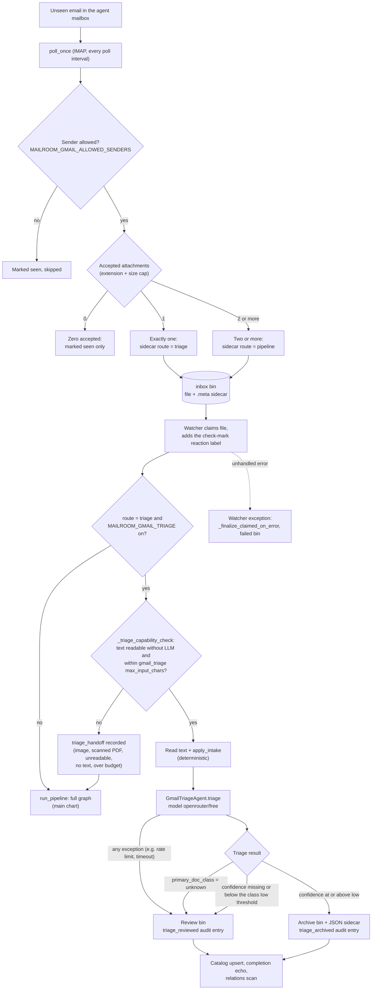
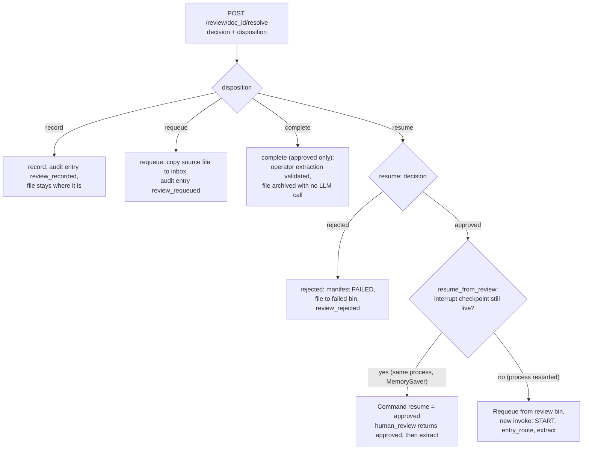

# Pipeline flowchart

This page draws the whole llm-mailroom document pipeline as one flowchart, built directly from the code. It shows:

* every node in the LangGraph state machine;
* every conditional edge, with the condition that picks it;
* the ways a document can enter;
* the per-class specialist dispatch;
* the judge, arbiter and reviewer loops;
* the human-review and failure routes;
* the work after a document reaches a terminal stage (audit log, completion echo, relations scan).

If you want the prose explanation of each stage, read [Architecture](../pipeline-reference-llm-mailroom/architecture.md) and [Agents](../pipeline-reference-llm-mailroom/agents.md). For the Gmail channel in depth, read [Gmail intake](../pipeline-reference-llm-mailroom/gmail-intake.md). This page is the map.

## How to read the chart

* Rectangles with a plain name such as `classify` are LangGraph nodes. The name is the exact string passed to `workflow.add_node(...)` in [`src/graph/build_graph.py`](https://github.com/Exios66/llm-mailroom/blob/main/src/graph/build_graph.py). The second line is the agent or helper that node calls.
* Solid arrows are graph edges. The label is the condition, taken from the router function in [`src/graph/routing.py`](https://github.com/Exios66/llm-mailroom/blob/main/src/graph/routing.py).
* A dashed arrow is one of two things. It is a transient-error self-loop (labelled `transient`), or a side effect outside the graph (audit writes, the Gmail echo, the relations scan).
* `high`, `low`, `retry_max`, `judge_band_high`, `judge_max_passes` and `arbiter_retry_max` are values from the `confidence:` block of [`src/config/taxonomy.yaml`](https://github.com/Exios66/llm-mailroom/blob/main/src/config/taxonomy.yaml). The numbers are in [Thresholds used by the routers](flowchart.md#thresholds-used-by-the-routers) below.
* `transient` means a provider error that `llm/retry.is_transient_error` treats as temporary (connection error, timeout, rate limit, 5xx). Each node has its own counter (`transient_retries_<node>`). The router retries the same node while that counter is 2 or less (`_TRANSIENT_MAX_RETRIES = 2`), then sends the document to `human_review`. Transient retries never use up the confidence retry budget.

## Three paths through the graph

The full chart below has many branches. Most documents take one of three routes, and it is easier to read the chart once you can follow these. The confidence values are the router thresholds listed in [Thresholds used by the routers](flowchart.md#thresholds-used-by-the-routers).

**1. The clean path (two LLM calls).** `intake` → `classify` → `extract` → `compile_report` → `catalog_write` → `archive`. The sorter returns confidence at or above `high`, so the document goes straight on. The specialist returns confidence at or above `judge_band_high`, so the judge is skipped. Everything after extraction is procedural.

**2. The doubtful classification (Lane A).** `classify` returns confidence from `low` up to `high`. The document goes to `retry_classify` first, while the retry budget (`retry_max`) lasts. If the confidence is still in that medium band, `review_classify` asks a second agent that has not seen the first answer. The document continues to `extract` only when the reviewer either agrees or overrides *and* its own confidence is at or above `high`. A low-confidence agreement, a disagreement or a reviewer error all go to `human_review`. Below `low` the document retries, and goes to review if retries run out.

**3. The doubtful extraction (Lane B).** `extract` returns confidence from `low` up to `judge_band_high`. `judge_verify` checks completeness. A `complete` verdict goes on to `compile_report`. A `partial` or `incomplete` verdict goes to `arbiter`. The arbiter picks exactly one of three outcomes:

* accept with caveats (on to `compile_report`);
* re-extract (back through `retry_extract`, bounded by `arbiter_retry_max`);
* `human_review`.

Two things can interrupt any of these paths. A **transient provider error** retries the same node. It does not spend the confidence budget. After the transient limit (`_TRANSIENT_MAX_RETRIES = 2`), the document goes to `human_review`. A **conflict** is a clash with an archived record of the same class in the same matter. A conflict sends the document to `boss_escalation`. An `approved` decision continues to `compile_report`. Any other decision goes to `human_review`.

## The full pipeline

```mermaid
flowchart TD
    %% ---------------- Entry points ----------------
    subgraph ENTRY["Entry points (outside the graph)"]
        direction TB
        UPLOAD["POST /upload<br/>api/main.py<br/>writes file + .meta sidecar"]
        GMAIL["Gmail poller<br/>gmail_intake.poll_once<br/>writes file + .meta sidecar"]
        INBOX[("inbox bin")]
        WATCH["Watcher claims file<br/>moves it to processing/worker_id/"]
        TRIQ{"_is_triage_route:<br/>route = triage, triage on,<br/>capability check passes?"}
        TRIAGE["Free Gmail triage lane<br/>_run_triage_lane<br/>(see Gmail diagram)"]
        PILOT["Pilot scripts<br/>run_pilot.py, run_hf_pilot.py,<br/>validate_pipeline.py"]
        RUNP["run_pipeline()"]
        RESUME["resume_from_review()<br/>(see review diagram)"]
    end

    UPLOAD --> INBOX
    GMAIL --> INBOX
    INBOX --> WATCH --> TRIQ
    TRIQ -- "yes" --> TRIAGE
    TRIQ -- "no (multi-attachment email, API upload,<br/>triage off, or capability handoff)" --> RUNP
    PILOT --> RUNP
    RUNP --> START
    RESUME -- "no live interrupt checkpoint:<br/>fresh invoke" --> START
    RESUME -. "live checkpoint:<br/>Command(resume=approved)" .-> N_HUMAN

    START(["START<br/>entry_route"])

    %% ---------------- Intake and classification ----------------
    subgraph CLASSIFY_STAGE["Intake and classification"]
        direction TB
        N_INTAKE["intake<br/>file read, intake clerk,<br/>optional BERT + IntakeAgent"]
        N_CLASSIFY["classify<br/>SorterAgent"]
        N_RETRY_CLASSIFY["retry_classify<br/>SorterAgent re-evaluation"]
        N_REVIEW_CLASSIFY["review_classify<br/>SorterReviewerAgent (Lane A)"]
    end

    START -- "default" --> N_INTAKE
    START -- "resume_extraction and<br/>review_decision = approved<br/>and doc_type set" --> N_EXTRACT
    N_INTAKE --> N_CLASSIFY

    N_CLASSIFY -. "transient" .-> N_CLASSIFY
    N_CLASSIFY -- "confidence at or above high" --> N_EXTRACT
    N_CLASSIFY -- "ground-truth class miss<br/>(pilot runs with labels)" --> N_REVIEW_CLASSIFY
    N_CLASSIFY -- "confidence below high<br/>and attempts within retry_max" --> N_RETRY_CLASSIFY
    N_CLASSIFY -- "doc_type not extractable (unknown, retired),<br/>or below high with retry budget spent" --> N_HUMAN

    N_RETRY_CLASSIFY -. "transient" .-> N_RETRY_CLASSIFY
    N_RETRY_CLASSIFY -- "confidence at or above high" --> N_EXTRACT
    N_RETRY_CLASSIFY -- "low to high band,<br/>or ground-truth class miss" --> N_REVIEW_CLASSIFY
    N_RETRY_CLASSIFY -- "doc_type not extractable,<br/>or still below low" --> N_HUMAN

    N_REVIEW_CLASSIFY -. "transient" .-> N_REVIEW_CLASSIFY
    N_REVIEW_CLASSIFY -- "reviewer_overrides or reviewer_agrees_high,<br/>reviewer confidence at or above high,<br/>extractable class, no ground-truth miss" --> N_EXTRACT
    N_REVIEW_CLASSIFY -- "anything else (reviewer_agrees_low,<br/>reviewer_conflicts, reviewer_error)" --> N_HUMAN

    %% ---------------- Extraction ----------------
    subgraph EXTRACT_STAGE["Extraction"]
        direction TB
        N_EXTRACT["extract<br/>specialist dispatch"]
        N_RETRY_EXTRACT["retry_extract<br/>specialist re-extraction<br/>(prior attempt + arbiter fix-list)"]
    end

    subgraph SPECIALISTS["Specialist dispatch by doc_type (inside extract and retry_extract)"]
        direction LR
        D{"taxonomy doc_classes<br/>key to specialist"}
        S_CONTRACT["contract<br/>ContractsSpecialist"]
        S_MERGER["merger_agreement<br/>MergerAgreementSpecialist"]
        S_CORP["corporate_record<br/>CorporateRecordsSpecialist"]
        S_CORR["correspondence<br/>CorrespondenceSpecialist"]
        S_INS["insurance_claim<br/>InsuranceClaimsSpecialist"]
        S_NONE["no specialist<br/>returns _unsupported stub"]
        D --> S_CONTRACT
        D --> S_MERGER
        D --> S_CORP
        D --> S_CORR
        D --> S_INS
        D --> S_NONE
    end

    N_EXTRACT -.-> D
    N_RETRY_EXTRACT -.-> D

    N_EXTRACT -. "transient" .-> N_EXTRACT
    N_EXTRACT -- "conflict_detected against<br/>archived matter records" --> N_BOSS
    N_EXTRACT -- "schema invalid, hollow payload,<br/>coverage below floor, or confidence below low;<br/>attempts within retry_max" --> N_RETRY_EXTRACT
    N_EXTRACT -- "confidence from low up to judge_band_high<br/>and MAILROOM_JUDGE_VERIFY on" --> N_JUDGE
    N_EXTRACT -- "confidence at or above low<br/>and judge gate not engaged" --> N_REPORT
    N_EXTRACT -- "unsupported type (no retry),<br/>or same failures with retry budget spent" --> N_HUMAN

    N_RETRY_EXTRACT -. "transient" .-> N_RETRY_EXTRACT
    N_RETRY_EXTRACT -- "schema invalid, hollow, coverage below floor,<br/>or confidence below low; attempts within retry_max" --> N_RETRY_EXTRACT
    N_RETRY_EXTRACT -- "conflict_detected" --> N_BOSS
    N_RETRY_EXTRACT -- "judge gate engaged" --> N_JUDGE
    N_RETRY_EXTRACT -- "confidence at or above low,<br/>judge gate not engaged" --> N_REPORT
    N_RETRY_EXTRACT -- "unsupported, or retry budget spent" --> N_HUMAN

    %% ---------------- Quality and escalation ----------------
    subgraph QUALITY["Quality checks and escalation"]
        direction TB
        N_JUDGE["judge_verify<br/>CompletenessJudge (Lane B)"]
        N_ARBITER["arbiter<br/>ArbiterAgent (Lane B)"]
        N_BOSS["boss_escalation<br/>BossAgent"]
    end

    N_JUDGE -. "transient" .-> N_JUDGE
    N_JUDGE -- "complete, skipped, or no verdict" --> N_REPORT
    N_JUDGE -- "partial or incomplete,<br/>judge_pass_count below judge_max_passes" --> N_ARBITER
    N_JUDGE -- "judge_error, or partial/incomplete<br/>with judge_max_passes reached" --> N_HUMAN

    N_ARBITER -. "transient" .-> N_ARBITER
    N_ARBITER -- "accept_with_caveats" --> N_REPORT
    N_ARBITER -- "retry_extraction and<br/>arbiter_retry_count within arbiter_retry_max" --> N_RETRY_EXTRACT
    N_ARBITER -- "human_review, arbiter failure,<br/>or retry bound exceeded" --> N_HUMAN

    N_BOSS -. "transient" .-> N_BOSS
    N_BOSS -- "review_decision = approved" --> N_REPORT
    N_BOSS -- "any other decision" --> N_HUMAN

    %% ---------------- Human review ----------------
    subgraph HITL["Human review"]
        direction TB
        N_HUMAN["human_review<br/>park in review bin, then interrupt()"]
    end

    N_HUMAN -- "approved: fresh extraction,<br/>attempt counters reset" --> N_EXTRACT
    N_HUMAN -- "rejected: file moved to failed bin" --> END_FAILED

    %% ---------------- Report, catalog, archive ----------------
    subgraph FINISH["Report, catalog and archive"]
        direction TB
        N_REPORT["compile_report<br/>compile_matter_record (procedural, no LLM)"]
        N_CATALOG["catalog_write<br/>SQLite documents + matters"]
        N_ARCHIVE["archive<br/>archivist.archive_document"]
    end

    N_REPORT -- "_report assembled" --> N_CATALOG
    N_REPORT -- "report_error or no _report" --> N_HUMAN
    N_CATALOG --> N_ARCHIVE
    N_ARCHIVE --> END_OK

    END_OK(["END: archived"])
    END_FAILED(["END: failed"])

    %% ---------------- Hard limits and crashes ----------------
    ABORT["_finalize_aborted<br/>failed bin + run_aborted audit"]
    LIMITS{{"any node: run deadline or<br/>output-token budget exceeded,<br/>or unhandled exception"}}
    LIMITS --> ABORT

    %% ---------------- Side effects after a terminal stage ----------------
    subgraph POST["Side effects (off the document path)"]
        direction TB
        AUDIT[("hash-chained audit log<br/>audit_log table")]
        ECHO["Gmail completion echo<br/>dispatch_intake_echo<br/>(Gmail-sourced documents only)"]
        REL["Relations clerk<br/>dispatch_relations_scan<br/>(daemon thread)"]
    end

    N_ARCHIVE -. "archived entry" .-> AUDIT
    N_ARCHIVE -.-> ECHO
    N_ARCHIVE -.-> REL
    N_HUMAN -. "routed_to_review entry" .-> AUDIT
    N_HUMAN -.-> ECHO
    N_HUMAN -.-> REL
    ABORT -.-> AUDIT
    ABORT -.-> ECHO
    ABORT -.-> REL
    REL -. "RELATED context block<br/>for later extractions" .-> N_EXTRACT
```

### Things the chart compresses

* **Router priority.** Each router checks its conditions in a fixed order and the first match wins. For `extract` and `retry_extract` the order in `after_extraction` is: transient error, unsupported type, conflict, schema invalid, hollow payload, ground-truth coverage below floor, then confidence. Only then does `after_extraction_gated` swap a `compile_report` result for `judge_verify` when `judge_gate` is true.
* **`classify` medium band.** Since change L-9 in `routing.py`, a confidence from `low` up to `high` goes to `retry_classify` first, while attempts are within `retry_max`. Only then does it go to `review_classify`. Below `low` also goes to `retry_classify` while budget remains.
* **Empty text.** If the document text is empty, `classify_node` sets `doc_type = unknown` and pushes `classification_attempts` past `retry_max`, so `after_classify` sends it straight to `human_review`.
* **`judge_verify` can skip itself.** The node re-checks `judge_gate`. When the gate is off (for example an arbiter-approved re-extraction that came back with high confidence) it returns `judge_verdict = skipped`, which routes to `compile_report`.
* **Interrupt pause.** `human_review` calls LangGraph `interrupt()`. The run stops there and `_execute_run` records it as a review park, not a failure. The approved/rejected edges only fire when someone resumes the paused thread (see [Human review resolve](flowchart.md#human-review-resolve)).
* **Audit entries.** Besides the three drawn above, `_emit_stage_audit` writes `ingested` (in `intake`), `classified` (in `classify`), `extracted` (in `extract`), `arbiter_decided` (in `arbiter`) and `boss_adjudicated` (in `boss_escalation`). Every entry links to the previous one for the same `doc_id` by hash.
* **Every node is bounded.** `_bounded` wraps each node, checks the run deadline and token budget, and touches a heartbeat on the catalog row before the node runs.

## Thresholds used by the routers

Values from the `confidence:` block of `src/config/taxonomy.yaml`. The per-class rows override `high`, `low` and `judge_band_high` once `doc_type` is known (`pipeline/config.py:get_confidence_thresholds`). Retry budgets stay global.

| Key                 | Global | contract | merger\_agreement | insurance\_claim | corporate\_record | correspondence |
| ------------------- | ------ | -------- | ----------------- | ---------------- | ----------------- | -------------- |
| `high`              | 0.97   | 0.98     | 0.98              | 0.98             | 0.96              | 0.95           |
| `low`               | 0.88   | 0.90     | 0.90              | 0.90             | 0.86              | 0.85           |
| `judge_band_high`   | 0.95   | 0.97     | 0.97              | 0.97             | 0.94              | 0.92           |
| `retry_max`         | 2      | global   | global            | global           | global            | global         |
| `arbiter_retry_max` | 2      | global   | global            | global           | global            | global         |
| `judge_max_passes`  | 3      | global   | global            | global           | global            | global         |

Notes:

* The coverage floor (`coverage_below_floor` in `pipeline/reconsideration.py`) uses the global `low` (0.88). It only applies when the run carries ground-truth `expected_fields`, so live documents without labels skip it.
* `routing.py` has hard-coded fallbacks (`low` 0.70, `high` 0.95, `retry_max` 2, `judge_band_high` 0.85, `judge_max_passes` 3, `arbiter_retry_max` 2). They are only used if a key is missing from the taxonomy.
* `conflict_threshold: 0.3` is in the taxonomy but the comment there says it is unused. Conflicts come from `_detect_conflict`, a field-by-field comparison with archived records of the same class in the same matter.
* The run limits come from `run_limits:` in the taxonomy: `deadline_seconds: 3600` and `max_total_output_tokens: 20000`.

## Node reference

One row per LangGraph node, in the order they are registered in `build_graph()`.

| Node              | Agent / code                                                                                                                                                                                                                                                                                                                                                                                                                                                                                                                                         | What it does                                                                                                                                                                                                                                                                                                                                                                                                                                                                                                                                                                     | Routes next (router)                                                                                                                                       |
| ----------------- | ---------------------------------------------------------------------------------------------------------------------------------------------------------------------------------------------------------------------------------------------------------------------------------------------------------------------------------------------------------------------------------------------------------------------------------------------------------------------------------------------------------------------------------------------------- | -------------------------------------------------------------------------------------------------------------------------------------------------------------------------------------------------------------------------------------------------------------------------------------------------------------------------------------------------------------------------------------------------------------------------------------------------------------------------------------------------------------------------------------------------------------------------------- | ---------------------------------------------------------------------------------------------------------------------------------------------------------- |
| `intake`          | `intake_node` in [build\_graph.py](https://github.com/Exios66/llm-mailroom/blob/main/src/graph/build_graph.py); [`agents/intake.py`](https://github.com/Exios66/llm-mailroom/blob/main/src/agents/intake.py), [`agents/bert_intake.py`](https://github.com/Exios66/llm-mailroom/blob/main/src/agents/bert_intake.py), [`agents/pdf_transcriber.py`](https://github.com/Exios66/llm-mailroom/blob/main/src/agents/pdf_transcriber.py), [`agents/image_extractor.py`](https://github.com/Exios66/llm-mailroom/blob/main/src/agents/image_extractor.py) | Claims the file if it is still in the inbox and reads its text (PDFs through `PDFTranscriber`, images through `ImageExtractor`, `.docx` and plain text directly). Runs the deterministic intake clerk `apply_intake`. Runs the ModernBERT triage `run_bert_intake` (off unless `MAILROOM_BERT_INTAKE=1`; always records a handoff). Runs `IntakeAgent` only when the text is messy or longer than the sorter's `max_input_chars` and `MAILROOM_LLM_INTAKE` is on. Renders page images for vision models. Writes the processing manifest, catalog row and `ingested` audit entry. | Always `classify` (plain edge).                                                                                                                            |
| `classify`        | `classify_node`; [`agents/sorter.py`](https://github.com/Exios66/llm-mailroom/blob/main/src/agents/sorter.py) (`SorterAgent`)                                                                                                                                                                                                                                                                                                                                                                                                                        | Sets `doc_type`, subtype/subclass and `classification_confidence`. Intake triage and BERT results ride along as labelled priors. Output passes `apply_classification_guard`.                                                                                                                                                                                                                                                                                                                                                                                                     | `after_classify`: `classify` (transient), `extract`, `retry_classify`, `review_classify`, `human_review`.                                                  |
| `retry_classify`  | `retry_classify_node`; `SorterAgent`                                                                                                                                                                                                                                                                                                                                                                                                                                                                                                                 | Re-runs the sorter with a "re-evaluate" prompt.                                                                                                                                                                                                                                                                                                                                                                                                                                                                                                                                  | `after_retry_classify`: `retry_classify` (transient), `extract`, `review_classify`, `human_review`.                                                        |
| `review_classify` | `review_classify_node`; [`agents/sorter_reviewer.py`](https://github.com/Exios66/llm-mailroom/blob/main/src/agents/sorter_reviewer.py) (`SorterReviewerAgent`)                                                                                                                                                                                                                                                                                                                                                                                       | Lane A (KANBAN-062). Classifies the document blind, then compares with the sorter in code and sets `review_verdict` to `reviewer_agrees_high`, `reviewer_agrees_low`, `reviewer_overrides`, `reviewer_conflicts` or `reviewer_error`. Only a winning verdict re-labels the document.                                                                                                                                                                                                                                                                                             | `after_review_classify`: `review_classify` (transient), `extract`, `human_review`.                                                                         |
| `extract`         | `extract_node`; the specialist picked by `_build_specialist_dispatch` (see below)                                                                                                                                                                                                                                                                                                                                                                                                                                                                    | Calls the specialist with a handoff context (sorter class, subtype, RELATED block from the relations clerk). Long documents are chunked (`chunking:` in the taxonomy). Applies `apply_extraction_guard` and `_detect_conflict`, records per-agent memory, writes the `extracted` audit entry.                                                                                                                                                                                                                                                                                    | `after_extraction_gated`: `extract` (transient), `retry_extract`, `judge_verify`, `compile_report`, `boss_escalation`, `human_review`.                     |
| `retry_extract`   | `retry_extract_node`; same specialist                                                                                                                                                                                                                                                                                                                                                                                                                                                                                                                | Re-extracts with the previous attempt, recent agent memory and, after an arbiter decision, the arbiter's `fields_to_fix` in the prompt.                                                                                                                                                                                                                                                                                                                                                                                                                                          | `after_retry_extraction_gated`: `retry_extract` (transient or another quality retry), `judge_verify`, `compile_report`, `boss_escalation`, `human_review`. |
| `judge_verify`    | `judge_verify_node`; [`agents/judge.py`](https://github.com/Exios66/llm-mailroom/blob/main/src/agents/judge.py) (`CompletenessJudge`)                                                                                                                                                                                                                                                                                                                                                                                                                | Lane B (KANBAN-063). Scores completeness of the extraction against the document. Increments `judge_pass_count`. Returns `skipped` if `judge_gate` is false, `judge_error` on a hard failure.                                                                                                                                                                                                                                                                                                                                                                                     | `after_judge`: `judge_verify` (transient), `compile_report`, `arbiter`, `human_review`.                                                                    |
| `arbiter`         | `arbiter_node`; [`agents/arbiter.py`](https://github.com/Exios66/llm-mailroom/blob/main/src/agents/arbiter.py) (`ArbiterAgent`)                                                                                                                                                                                                                                                                                                                                                                                                                      | Decides on a partial or incomplete judge verdict: `accept_with_caveats`, `retry_extraction` (with a fix-list; increments `arbiter_retry_count`) or `human_review`. Writes the `arbiter_decided` audit entry.                                                                                                                                                                                                                                                                                                                                                                     | `after_arbiter`: `arbiter` (transient), `compile_report`, `retry_extract`, `human_review`.                                                                 |
| `human_review`    | `human_review_node`; `pipeline/bins.park_for_review`, `pipeline/reconsideration.collect_review_causes`                                                                                                                                                                                                                                                                                                                                                                                                                                               | Parks the file in the review bin with a `pending_review` manifest and the review causes, upserts the catalog, writes `routed_to_review` (first park only), fires the Gmail echo and relations scan, then pauses with `interrupt()`. On rejection it moves the file to the failed bin.                                                                                                                                                                                                                                                                                            | `after_human_review`: `extract` (approved) or END (rejected).                                                                                              |
| `boss_escalation` | `boss_escalation_node`; [`agents/boss.py`](https://github.com/Exios66/llm-mailroom/blob/main/src/agents/boss.py) (`BossAgent`)                                                                                                                                                                                                                                                                                                                                                                                                                       | Adjudicates a field conflict with archived matter records, using the matter context from `_fetch_matter_context`. A non-transient failure defaults to `review`. Writes `boss_adjudicated`.                                                                                                                                                                                                                                                                                                                                                                                       | `after_boss`: `boss_escalation` (transient), `compile_report`, `human_review`.                                                                             |
| `compile_report`  | `compile_report_node`; [`agents/reporter.py`](https://github.com/Exios66/llm-mailroom/blob/main/src/agents/reporter.py) (`compile_matter_record`)                                                                                                                                                                                                                                                                                                                                                                                                    | Builds the structured matter record procedurally (the reporter LLM is retired) and stores it as `extracted_data._report`. A crash produces a fallback report with `error: True`.                                                                                                                                                                                                                                                                                                                                                                                                 | `after_report`: `catalog_write` or `human_review`.                                                                                                         |
| `catalog_write`   | `catalog_write_node`; `storage/catalog`                                                                                                                                                                                                                                                                                                                                                                                                                                                                                                              | Upserts the document and matter rows with final type, confidences and extraction.                                                                                                                                                                                                                                                                                                                                                                                                                                                                                                | Always `archive` (plain edge).                                                                                                                             |
| `archive`         | `archive_node`; [`agents/archivist.py`](https://github.com/Exios66/llm-mailroom/blob/main/src/agents/archivist.py) (`archive_document`)                                                                                                                                                                                                                                                                                                                                                                                                              | Moves the file to `archive/<matter_id>/<doc_type>/`, writes the manifest and a JSON sidecar, hashes the file, appends the `archived` audit entry, sets the catalog row to archived, fires the Gmail echo and relations scan, and exports to the warehouse if enabled.                                                                                                                                                                                                                                                                                                            | Always END (plain edge).                                                                                                                                   |

### Specialist dispatch

`_specialist_extractor_map()` maps the taxonomy `specialist:` names to extract functions. `build_graph()` calls `_build_specialist_dispatch()` first and refuses to build if any live taxonomy class has no specialist.

| `doc_type`         | Specialist                                                              | Source                                                                                                                                   |
| ------------------ | ----------------------------------------------------------------------- | ---------------------------------------------------------------------------------------------------------------------------------------- |
| `contract`         | `ContractsSpecialist`                                                   | [`agents/contracts_specialist.py`](https://github.com/Exios66/llm-mailroom/blob/main/src/agents/contracts_specialist.py)                 |
| `merger_agreement` | `MergerAgreementSpecialist`                                             | [`agents/merger_agreement_specialist.py`](https://github.com/Exios66/llm-mailroom/blob/main/src/agents/merger_agreement_specialist.py)   |
| `corporate_record` | `CorporateRecordsSpecialist`                                            | [`agents/corporate_records_specialist.py`](https://github.com/Exios66/llm-mailroom/blob/main/src/agents/corporate_records_specialist.py) |
| `correspondence`   | `CorrespondenceSpecialist`                                              | [`agents/correspondence_specialist.py`](https://github.com/Exios66/llm-mailroom/blob/main/src/agents/correspondence_specialist.py)       |
| `insurance_claim`  | `InsuranceClaimsSpecialist`                                             | [`agents/insurance_claims_specialist.py`](https://github.com/Exios66/llm-mailroom/blob/main/src/agents/insurance_claims_specialist.py)   |
| anything else      | none: `_unsupported_extraction_update` returns `{"_unsupported": true}` | `after_extraction` sends it to `human_review` with no retry                                                                              |

`unknown` is a routing token the sorter may emit, not a class. `EXTRACT_CLASS_ALIASES` in `pipeline/config.py` is currently empty, so only the five keys above are extractable.

## Gmail intake path

The Gmail channel is a separate flow. The poller only writes files into the inbox. The watcher then sends each file to one of two places: the free triage lane (outside the LangGraph graph), or the full pipeline above. Details and environment variables are in [Gmail intake](../pipeline-reference-llm-mailroom/gmail-intake.md).

The triage lane writes its own audit vocabulary: `triage_ingested`, `triage_classified`, then `triage_archived` or `triage_reviewed`. When the triage call itself fails, only `triage_ingested` and `triage_reviewed` are written and the escalation reason starts with `triage_llm_unavailable`. Documents from Gmail that run the full pipeline get the same completion echo from `archive`, `human_review` or `_finalize_aborted`.

## Human review resolve

A parked document leaves the review bin through `POST /review/{doc_id}/resolve` in [`api/main.py`](https://github.com/Exios66/llm-mailroom/blob/main/src/api/main.py), with helpers in [`pipeline/review_resolve.py`](https://github.com/Exios66/llm-mailroom/blob/main/src/pipeline/review_resolve.py). The `disposition` field picks the path; `resume` is the default.

`record` and `requeue` work at any stage. `complete` and `resume` need the document to be in the review stage. A classification override (`doc_type` or `override_doc_type`) can be written onto the manifest before a resume.

## Sources

* [`src/graph/build_graph.py`](https://github.com/Exios66/llm-mailroom/blob/main/src/graph/build_graph.py): node functions, `build_graph()`, `entry_route`, `run_pipeline`, `resume_from_review`, `_finalize_aborted`
* [`src/graph/routing.py`](https://github.com/Exios66/llm-mailroom/blob/main/src/graph/routing.py): every router and `judge_gate`
* [`src/graph/state.py`](https://github.com/Exios66/llm-mailroom/blob/main/src/graph/state.py): `DocumentState`
* [`src/config/taxonomy.yaml`](https://github.com/Exios66/llm-mailroom/blob/main/src/config/taxonomy.yaml): thresholds, doc classes, specialists, run limits, relations settings
* [`src/pipeline/config.py`](https://github.com/Exios66/llm-mailroom/blob/main/src/pipeline/config.py): `get_confidence_thresholds`, `is_extractable_doc_type`
* [`src/pipeline/reconsideration.py`](https://github.com/Exios66/llm-mailroom/blob/main/src/pipeline/reconsideration.py): ground-truth miss, hollow, coverage and report checks
* [`src/pipeline/watcher.py`](https://github.com/Exios66/llm-mailroom/blob/main/src/pipeline/watcher.py): claim, triage routing, `_run_triage_lane`
* [`src/pipeline/gmail_intake.py`](https://github.com/Exios66/llm-mailroom/blob/main/src/pipeline/gmail_intake.py): poller, route stamping, completion echo
* [`src/pipeline/review_resolve.py`](https://github.com/Exios66/llm-mailroom/blob/main/src/pipeline/review_resolve.py) and [`src/api/main.py`](https://github.com/Exios66/llm-mailroom/blob/main/src/api/main.py): review dispositions and `/upload`
* [`src/pipeline/relations.py`](https://github.com/Exios66/llm-mailroom/blob/main/src/pipeline/relations.py): `dispatch_relations_scan`, `context_block`
* [`src/pipeline/failures.py`](https://github.com/Exios66/llm-mailroom/blob/main/src/pipeline/failures.py): abort `failure_class` values
* [`src/agents/`](https://github.com/Exios66/llm-mailroom/blob/main/src/agents/README.md): agent classes named in the table
* [Architecture](../pipeline-reference-llm-mailroom/architecture.md) and [Gmail intake](../pipeline-reference-llm-mailroom/gmail-intake.md): existing diagrams this page was checked against
