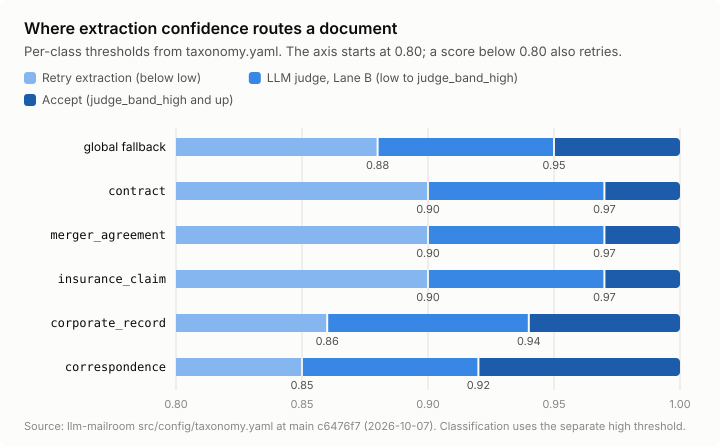
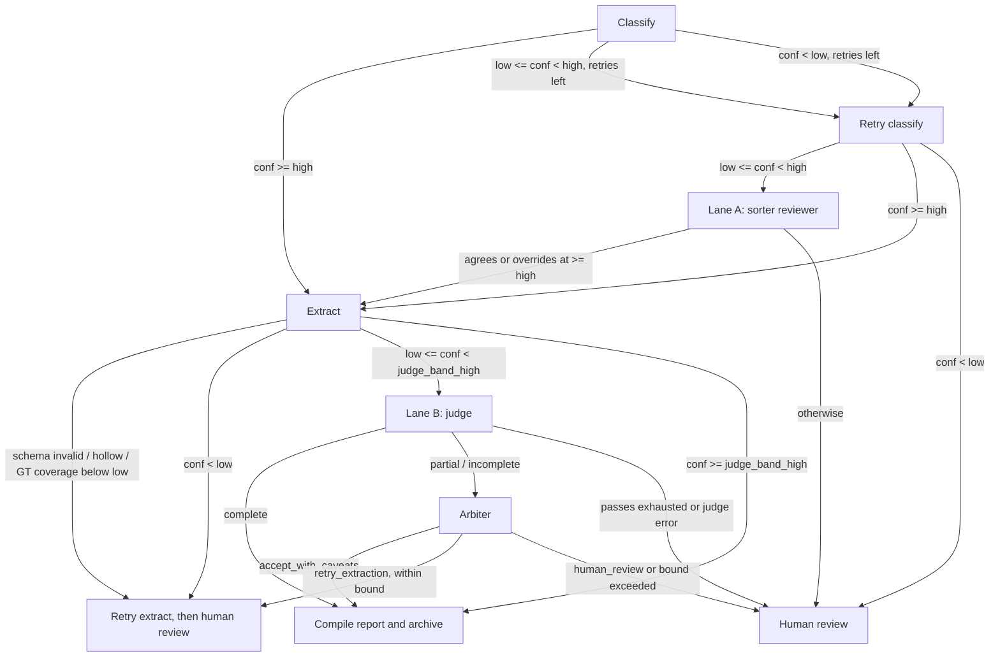

# Scoring and performance

This page explains two things:

1. **How the pipeline scores its own work.** This part covers five topics:
   * how the scorer compares each specialist's extraction with ground truth, field by field;
   * how field scores become a document score and a per-specialist suite score;
   * how the scorer grades classification;
   * how the LLM judges and the arbiter grade;
   * how confidence and scores send a document to the archive or to review.
2. **What has actually been measured.** The recorded accuracy, F1, latency and cost numbers that exist today, each with its source file, run id, date and model. It also lists the metrics the pipeline emits at runtime and where to look at them.

Short version: the scoring logic is well defined and lives mostly in the [llm-dojo-scoring](https://github.com/Exios66/llm-dojo-scoring) package. Measured results are **thin**. Most numbers come from isolated per-agent runs in the sibling [eval-environment](https://github.com/LLM-Mailroom-Services/eval-environment) repo (20 to 100 documents per run, late September 2026). This repo has no recorded end-to-end scorecard for the current release (0.8.0).

### Three things to hold in mind while reading

* **A score is a mean of field scores, not a share of correct documents.** An `overall` of 0.50 means that, averaged over all scored fields, the extraction earned half credit. It does not mean half the documents were wrong. Partial credit is common: a name that is nearly right, a list that is half complete.
* **Every field counts equally.** There are no weights, so a long list of keywords moves the score as much as an effective date does.
* **Scores answer different questions at different layers.** Field scores grade *what the specialist wrote*. Routing confidence decides *what happens next to the document*. The two are separate: field scores are computed after the run on grounded (ground-truth) runs, and they do not route documents inside the graph.

For the pipeline stages referenced below, see [Pipeline flowchart](flowchart.md) and [Architecture](../pipeline-reference-llm-mailroom/architecture.md). For the fields each specialist extracts, see [Extraction schemas](extraction-schemas.md).


**Scoring in this release.** Specialist scoring now goes through the dojo's per-document scorer (`suite.score_document`, [PR #87](https://github.com/Exios66/llm-mailroom/pull/87)): field-level precision, recall, F1 and F2, class-specific extras, a `metric_id` and provenance. A document with nothing scorable gets `overall_score = None` instead of a number.


***

## Part 1: Scoring methodology

### Where the scoring code lives

| Layer                 | What it does                                                           | Code                                                                                                                                                                                                                                                                                                       |
| --------------------- | ---------------------------------------------------------------------- | ---------------------------------------------------------------------------------------------------------------------------------------------------------------------------------------------------------------------------------------------------------------------------------------------------------- |
| Scoring library       | Per-field matchers, document score, specialist suites, metric registry | [llm-dojo-scoring](https://github.com/Exios66/llm-dojo-scoring), pinned at **v0.21.0** in `pyproject.toml` (`llm-dojo-scoring @ git+https://github.com/Exios66/llm-dojo-scoring.git@v0.21.0`)                                                                                                              |
| Wiring                | Loads `taxonomy.yaml` into the library's settings at import time       | [`observability/scoring_wiring.py`](https://github.com/Exios66/llm-mailroom/blob/main/src/observability/scoring_wiring.py)                                                                                                                                                                                 |
| Specialist suites     | One suite per live extract class, mapped to its specialist             | [`observability/specialist_suites.py`](https://github.com/Exios66/llm-mailroom/blob/main/src/observability/specialist_suites.py), [`observability/suite_scoring.py`](https://github.com/Exios66/llm-mailroom/blob/main/src/observability/suite_scoring.py)                                                 |
| Trace wiring          | Pushes field and document scores to Langfuse                           | [`observability/langfuse_field_scoring.py`](https://github.com/Exios66/llm-mailroom/blob/main/src/observability/langfuse_field_scoring.py), [`observability/scores.py`](https://github.com/Exios66/llm-mailroom/blob/main/src/observability/scores.py)                                                     |
| Classification        | Exact class match                                                      | [`observability/classification_scoring.py`](https://github.com/Exios66/llm-mailroom/blob/main/src/observability/classification_scoring.py)                                                                                                                                                                 |
| Run-level diagnostics | Error decomposition, MAE, R², list micro F1                            | [`observability/metrics.py`](https://github.com/Exios66/llm-mailroom/blob/main/src/observability/metrics.py)                                                                                                                                                                                               |
| Ground truth          | Hub labels plus conservative regex fills                               | [`observability/extraction_gt.py`](https://github.com/Exios66/llm-mailroom/blob/main/src/observability/extraction_gt.py), [`observability/posthoc_gt.py`](https://github.com/Exios66/llm-mailroom/blob/main/src/observability/posthoc_gt.py)                                                               |
| Honesty gaps          | Flags suites whose scores are degenerate                               | [`observability/honest_gaps.py`](https://github.com/Exios66/llm-mailroom/blob/main/src/observability/honest_gaps.py)                                                                                                                                                                                       |
| LLM judges            | Completeness, classification and correctness rubrics                   | [`agents/judge.py`](https://github.com/Exios66/llm-mailroom/blob/main/src/agents/judge.py), [`agents/arbiter.py`](https://github.com/Exios66/llm-mailroom/blob/main/src/agents/arbiter.py), [`agents/sorter_reviewer.py`](https://github.com/Exios66/llm-mailroom/blob/main/src/agents/sorter_reviewer.py) |
| Routing               | Confidence bands, judge gate, arbiter bounds                           | [`graph/routing.py`](https://github.com/Exios66/llm-mailroom/blob/main/src/graph/routing.py)                                                                                                                                                                                                               |

> **Version note.** The pipeline pins llm-dojo-scoring **v0.21.0**. The eval-environment repo, where most measured numbers come from, resolved the library at **v0.15.0** (its `pyproject.toml` comment). Scores from different library versions are not guaranteed to be comparable.

### Field types

Each field of each specialist schema has a scoring type, set in `doc_classes[].field_types` in [`config/taxonomy.yaml`](https://github.com/Exios66/llm-mailroom/blob/main/src/config/taxonomy.yaml). For example, the `contract` class (the `intent` field of `corporate_record`, `correspondence` and `insurance_claim` has type `label`, as in `intent: label`):

```yaml
field_types:
  document_name: name
  parties: entity_list:name
  effective_date: date
  term_length: free_text
  governing_law: name
  contract_value: money
  renewal_terms: free_text
  cuad_family: name
  merger_consideration: name
  cuad_clauses: entity_list:free_text
  maud_clauses: entity_list:free_text
```

A field with no mapped type gets a heuristic type from its name:

* A list value is an `entity_list`.
* A name that contains `date` is `date`.
* A name that contains `value`, `amount`, `fee`, `price`, `cost`, `total` (and a few others) is `money`.
* A name that contains `number`, `id`, `docket`, `reference` or `filing` is `id`.
* Every other field is `name`.

The fields `confidence` and `reasoning` are never scored.

### Per-field match rules

Every rule returns a score from 0 to 1. Source: [`llm_dojo_scoring/field_scoring.py`](https://github.com/Exios66/llm-dojo-scoring/blob/v0.21.0/llm_dojo_scoring/field_scoring.py).

| Type                    | Rule                                                                                                                                                                                                                                                                      | Score                                              |
| ----------------------- | ------------------------------------------------------------------------------------------------------------------------------------------------------------------------------------------------------------------------------------------------------------------------- | -------------------------------------------------- |
| `id`                    | Uppercase, strip punctuation and whitespace, then exact match                                                                                                                                                                                                             | 1.0 or 0.0                                         |
| `money`                 | Strip `$ € £` and commas, expand `K`/`M`/`B`, drop `USD`/ `DOLLARS`/ `EUROS`, parse to a float. Match when the difference is at most **0.01** (one cent). If either side does not parse, fall back to the `name` rule                                                     | 1.0 or 0.0 (or the `name` score)                   |
| `date`                  | See the date rules below                                                                                                                                                                                                                                                  | 1.0, 0.67, 0.33 or 0.0 (or the `name` score)       |
| `label`                 | Canonicalize both sides, then exact match. No partial credit. `score_label_field`. The scorer first maps `intent` through `normalize_intent` for the three classes that have a vocabulary | 1.0 or 0.0                                         |
| `name`                  | Normalize (uppercase, strip punctuation and corporate suffixes such as `INC`, `LLC`, `LTD`). If all expected tokens appear in the prediction, score 1.0. Otherwise take the token-set ratio, and also Jaro-Winkler when the two share at least one token; keep the higher | 0.0 to 1.0                                         |
| `free_text`             | SQuAD-style token F1 over lowercase token multisets                                                                                                                                                                                                                       | 0.0 to 1.0                                         |
| `containment`           | Share of the **expected** text's tokens (stopwords removed) that appear in the prediction                                                                                                                                                                                 | 0.0 to 1.0                                         |
| `entity_list:<element>` | Optimal one-to-one matching (Hungarian algorithm) over a pairwise similarity matrix built with the element rule. A pair counts as matched when similarity is at least **0.6** (`bipartite_match_threshold`)                                                               | F1, or recall for partial-label fields (see below) |

**Date rules, in order:**

1. If the expected text holds no real date, an empty prediction scores 1.0 and any prediction scores 0.0. Examples: a blank template line such as `_____ day of ________`, or a bare label.
2. If the expected date phrase appears inside the prediction (or the other way round), score 1.0.
3. If both parse, the score is:

   | Match | Score |
   | --- | ---: |
   | Same date | 1.0 |
   | Same year and month | 0.67 |
   | Within 45 days | 0.67 |
   | Same year only, or same month only | 0.33 |
   | Any other pair | 0.0 |

4. If either side does not parse, fall back to the `name` rule.

**Containment fields.** These fields are scored with the `containment` rule when their type is `name` or `free_text`: `governing_law`, `term_length`, `renewal_terms`, `subject_matter`.

**Partial-label fields.** For these list fields, the ground truth is a sample, not a full list. So the field score is **recall** (ground-truth coverage), not F1: `parties`, `keywords`, `cuad_clauses`, `maud_clauses`, `claim_checklist`, `action_items`. Role words in the label set (`seller`, `buyer`, `licensee` and similar) count as matched when the prediction names any party.

**Embedding rescue.** `taxonomy.yaml` turns on `embedding_enabled: true` with `sentence-transformers/all-MiniLM-L6-v2`. For `name` and `free_text` scores below **0.7** (`embedding_rescue_below`), the scorer also computes embedding cosine similarity and keeps the higher of the two. It never lowers a score.

**Entity list formulas** (from `score_entity_list`):

```
matched   = pairs with similarity >= 0.6, capped at min(n_predicted, n_expected)
precision = matched / n_predicted
recall    = matched / n_expected
f1        = 2 * precision * recall / (precision + recall)   (0 when matched = 0)
```

**Weights.** There are none. Every scored field counts equally in the document score.

### Document score

`score_extraction` produces one result per document:

* Only expected fields with a non-null, non-empty value are scored. A null expectation is not a requirement.
* A missing prediction for a required field scores 0.0 (except the blank-date case above).
* **`overall_score` is the plain mean of the per-field scores** (rounded to 4 places), or `None` if no field was scored.
* `ambiguous_fields` lists every field in the ambiguous band `0.5 <= score <= 0.85`. `needs_judge_review` is true when that list is not empty.

```
overall_score = sum(field_scores) / count(field_scores)
```

**A worked example.** The numbers below are illustrative, not from a recorded run. A contract has four expected fields, and the specialist returns three of them.

| Field | Type and rule | Expected | Predicted | Field score |
| ----- | ------------- | -------- | --------- | ----------: |
| `effective_date` | `date`, same calendar date | 2024-01-15 | January 15, 2024 | 1.00 |
| `governing_law` | `name` scored by containment: every expected token appears | Delaware | State of Delaware | 1.00 |
| `parties` | partial-label `entity_list`: recall, with one of two expected parties matched | Acme Corp; Beta LLC | Acme Corp | 0.50 |
| `term_length` | required field, no prediction | 3 years | (missing) | 0.00 |

The mean is (1.00 + 1.00 + 0.50 + 0.00) / 4 = **0.625**. Notice what moved the score: the missing `term_length` cost 0.25 on its own, while the date written in a different format cost nothing, because dates are normalized before comparison. The `parties` field scores exactly 0.5, which sits on the edge of the ambiguous band (0.5 to 0.85, inclusive), so it is listed in `ambiguous_fields` and `needs_judge_review` is true. The band's inclusive lower bound is what makes this boundary case count.

> **Note on `type_bands`.** `taxonomy.yaml` defines per-type bands (`date: never`, `id: never`, `money: [0.675, 0.938]`, `free_text: [0.6, 0.95]`, `name: [0.5, 1.0]`, `entity_list: [0.5, 1.0]`) and comments say they were calibrated by [`scripts/calibrate_field_scoring.py`](https://github.com/Exios66/llm-mailroom/blob/main/src/scripts/calibrate_field_scoring.py). In the pinned v0.21.0, these bands are read by the library function `field_is_ambiguous`, but `score_extraction` checks only the global `ambiguous_band` \[0.5, 0.85]. The pipeline does not call `field_is_ambiguous`. So in practice the global band decides `needs_judge_review`.

**Factuality audit.** When the source text is available (`factuality_verification.enabled: true`), every field the model filled in is checked, including fields with no ground-truth label. A predicted item is "true" in one of two cases. It matches a ground-truth label at the 0.6 threshold, or at least **70%** of its tokens (`token_coverage: 0.7`) appear in the source document. This gives `verified_precision` and `hallucination_rate` per field. The document-level values are means over audited fields.

### Specialist suites

Each live extract class has one dedicated suite, keyed by the class name and paired with its specialist. Source: [`observability/specialist_suites.py`](https://github.com/Exios66/llm-mailroom/blob/main/src/observability/specialist_suites.py).

| Class              | Specialist                     | Headline extras reported when present                                     |
| ------------------ | ------------------------------ | ------------------------------------------------------------------------- |
| `contract`         | `contracts_specialist`         | `extraction_f1`, `extraction_precision`, `extraction_recall`              |
| `merger_agreement` | `merger_agreement_specialist`  | `maud_question_accuracy`, `maud_question_macro_accuracy`, `extraction_f1` |
| `corporate_record` | `corporate_records_specialist` | `extraction_f1`, `entity_list_f1`                                         |
| `correspondence`   | `correspondence_specialist`    | `content_topic_accuracy`, `sentiment_accuracy`, `extraction_f1`           |
| `insurance_claim`  | `insurance_claims_specialist`  | `determination_consistency`, `amount_exactness`, `extraction_f1`          |

How a suite score is built (`score_with_suite` in [`observability/suite_scoring.py`](https://github.com/Exios66/llm-mailroom/blob/main/src/observability/suite_scoring.py)):

1. Call the library's `get_suite(doc_class).score(expected, predicted, doc_text=..., field_types=...)`. This returns the same per-field result as above, sometimes with extras (Enron topic and sentiment for correspondence, MAUD per-question metrics for merger agreements).
2. Add field-level micro precision, recall, F1 and F2 (`extraction_binary_metrics`), and for insurance claims the claims extras (`score_claims_extras`).
3. If the class has no live suite, fall back to plain `score_extraction`.

A suite score is per document. Run-level numbers (for example "overall 0.5104" in the results below) are means of per-document `overall_score` over the run, as computed by the eval harness.

**Honesty gaps.** Some suites carry an `honest_gap` note that is copied into the trace comment. The main one is insurance: every CMS DE-SynPUF ground-truth row is `approved` with empty `denial_reasons`. So `determination_consistency` is always 1.0 on those rows. It is **not** a quality KPI there (`determination_consistency_is_quality`). See [`observability/honest_gaps.py`](https://github.com/Exios66/llm-mailroom/blob/main/src/observability/honest_gaps.py) and the [Agents](../pipeline-reference-llm-mailroom/agents.md) page.

**Ground truth.** [`observability/extraction_gt.py`](https://github.com/Exios66/llm-mailroom/blob/main/src/observability/extraction_gt.py) builds ground truth per class. Hub labels (CUAD clauses, MAUD questions, CMS columns) always win. Conservative regexes over the source text fill the remaining schema fields ([`observability/posthoc_gt.py`](https://github.com/Exios66/llm-mailroom/blob/main/src/observability/posthoc_gt.py)). The scorer records the provenance, so a regex fill never shows as an official label.

### Run-level diagnostics

[`observability/metrics.py`](https://github.com/Exios66/llm-mailroom/blob/main/src/observability/metrics.py) (`extraction_diagnostics`) aggregates per-document results into run-level numbers. It is a reporting tool, not a runtime metrics exporter.

| Metric                                                        | Definition in code                                                                          |
| ------------------------------------------------------------- | ------------------------------------------------------------------------------------------- |
| `field_exact_rate` / `field_partial_rate` / `field_miss_rate` | Share of field scores that are `>= 1.0` / between 0 and 1 / `<= 0.0`                        |
| `entity_list_precision` / `recall` / `raw_f1`                 | Per-field means of the list scores                                                          |
| `list_micro_precision` / `recall` / `f1`                      | Pooled over all list fields: `matched / n_predicted`, `matched / n_expected`, harmonic mean |
| `date_mae_days`, `duration_mae_days`, `money_mae_usd`         | Mean absolute error over pairs where both sides parse (plus medians)                        |
| `date_r2`, `duration_r2`                                      | `1 - SS_res / SS_tot` over the same pairs; `None` with fewer than 2 pairs or zero variance  |
| `span_count_mae`, `span_count_signed_mean`                    | Predicted minus expected list length per document (positive means over-extraction)          |

### Classification metrics

Source: [`observability/classification_scoring.py`](https://github.com/Exios66/llm-mailroom/blob/main/src/observability/classification_scoring.py).

* `class_correct` is an **exact** match after lowercasing and trimming. `merger_agreement` predicted as `contract` is a miss.
* Run-level `exact_accuracy = exact matches / n`. The `aligned_accuracy` key in older reports is a deprecated alias that equals exact accuracy.
* `stage_correct` compares the final stage with `expected_stage` from ground truth.
* `confidence_calibration_error` (pilot runs, [`scripts/run_pilot.py`](https://github.com/Exios66/llm-mailroom/blob/main/src/scripts/run_pilot.py)) is `|classification_confidence - class_correct|` for one document.

**LegalBench** ([`legalbench/scoring.py`](https://github.com/Exios66/llm-mailroom/blob/main/src/legalbench/scoring.py)) scores locally with no LLM grading:

| Task kind                            | Metrics                                                                                                                   |
| ------------------------------------ | ------------------------------------------------------------------------------------------------------------------------- |
| Binary (`contract_qa`)               | `accuracy`, `macro_category_accuracy`, `yes_f1`, `calibration_error`                                                      |
| Multiclass (`family_classification`) | strict `accuracy`, `accuracy_equiv` (equivalent subtypes count), `macro_f1` (one-vs-rest per family), `calibration_error` |

`calibration_error` is expected calibration error with 10 equal-width bins: for each bin, `(bin size / n) * |mean confidence - accuracy|`, summed.

### LLM-as-judge rubrics

There are three layers of LLM judging. None of them use numeric thresholds computed in code except where stated.

**1. In-pipeline completeness judge (Lane B).** `CompletenessJudge.judge_completeness` in [`agents/judge.py`](https://github.com/Exios66/llm-mailroom/blob/main/src/agents/judge.py), run by the `judge_verify` node. It sees the schema field list, the extraction and up to 16,000 characters of source text, at temperature 0. It returns:

| Output               | Values                                                                        |
| -------------------- | ----------------------------------------------------------------------------- |
| `completeness`       | 0.0 to 1.0, "fraction of expected fields correctly captured"                  |
| `completeness_label` | `complete` (score at least 0.95), `partial` (at least 0.5), else `incomplete` |
| `reasoning`          | gaps or fabrications found                                                    |

The label thresholds are part of the prompt; the code trusts the label the model returns. A parse failure becomes `0.0` / `incomplete`.

**2. Offline per-dimension judges.** [`scripts/run_quality_judges.py`](https://github.com/Exios66/llm-mailroom/blob/main/src/scripts/run_quality_judges.py) runs the same judge class over a pilot report on three dimensions and writes per-class means:

| Dimension      | Score                             | Label                                 |
| -------------- | --------------------------------- | ------------------------------------- |
| classification | `classification_quality` (0 to 1) | `correct` / `incorrect` / `ambiguous` |
| completeness   | `completeness` (0 to 1)           | `complete` / `partial` / `incomplete` |
| correctness    | `extraction_correctness` (0 to 1) | `accurate` / `partial` / `inaccurate` |

**3. Hosted Langfuse evaluators.** [`scripts/sync_evaluators.py`](https://github.com/Exios66/llm-mailroom/blob/main/src/scripts/sync_evaluators.py) deploys two evaluators that both read the single `pipeline-result` generation per document:

* `mailroom-pipeline-judge`: one categorical verdict, `CORRECT`, `PARTIAL` or `MISS`. With ground truth it compares strictly against expected class, stage and fields; without it, it judges against the taxonomy and document text.
* `mailroom-pipeline-quality`: a proportional 0.0 to 1.0 quality score, separate from the verdict.

On grounded runs the deterministic scorer runs first. If no field is in the ambiguous band, the `pipeline-result` generation is not emitted, so the hosted judges do not run (a class mismatch always forces the judge). The pipeline also writes a `deterministic_verdict` score: `MISS` on class mismatch, `PARTIAL` when a field is ambiguous or there is no score, `CORRECT` when `overall_score >= 0.85`, `MISS` when `overall_score <= 0.5`, otherwise `PARTIAL`.

**Arbiter.** When the in-pipeline judge returns `partial` or `incomplete`, the arbiter ([`agents/arbiter.py`](https://github.com/Exios66/llm-mailroom/blob/main/src/agents/arbiter.py)) picks exactly one of `accept_with_caveats`, `retry_extraction` or `human_review`. Any other answer is forced to `human_review`.

**Sorter reviewer (Lane A).** A blind second classification ([`agents/sorter_reviewer.py`](https://github.com/Exios66/llm-mailroom/blob/main/src/agents/sorter_reviewer.py)). Agreement is computed in code, not by the model.

### Confidence thresholds and routing

The sorter and specialists report their own confidence (0 to 1). Thresholds come from the `confidence:` block of `taxonomy.yaml`; per-class values override the globals once the class is known.

| Scope              | `high` | `low` | `judge_band_high` |
| ------------------ | -----: | ----: | ----------------: |
| Global fallback    |   0.97 |  0.88 |              0.95 |
| `contract`         |   0.98 |  0.90 |              0.97 |
| `merger_agreement` |   0.98 |  0.90 |              0.97 |
| `insurance_claim`  |   0.98 |  0.90 |              0.97 |
| `corporate_record` |   0.96 |  0.86 |              0.94 |
| `correspondence`   |   0.95 |  0.85 |              0.92 |

<figure><picture><source srcset="../.gitbook/assets/chart-extraction-routing-dark.svg" media="(prefers-color-scheme: dark)"></picture><figcaption><p>Extraction confidence bands per class. The table above holds the same values. Rebuild the chart with <code>scripts/build_charts.py</code>.</p></figcaption></figure>

Other knobs: `retry_max: 2`, `arbiter_retry_max: 2`, `judge_max_passes: 3`.



Key points, all from [`graph/routing.py`](https://github.com/Exios66/llm-mailroom/blob/main/src/graph/routing.py):

* **Auto-accept** means: classification confidence at least `high`, extraction schema-valid and not hollow, extraction confidence at least `judge_band_high` (judge skipped), or the judge says `complete`, or the arbiter says `accept_with_caveats`.
* On pilot runs with ground truth, a class that misses ground truth goes to Lane A, even at high confidence. Extraction coverage below `low` triggers a retry (`coverage_below_floor` in [`pipeline/reconsideration.py`](https://github.com/Exios66/llm-mailroom/blob/main/src/pipeline/reconsideration.py)).
* **The deterministic field scores do not route documents inside the graph.** The pipeline computes them only on grounded runs, after the run. They decide whether the hosted judge fires. They also decide which reconsideration causes the pipeline records (`extraction_needs_judge_review`, and `extraction_miss` when `overall_score < low`).
* `success_rate` (first-pass straight-through processing) is 1 only when the document archived in one pass with no retry, Lane A, arbiter, boss, human review, guardrail, parse or schema failure, or transient self-loop (`first_pass_success` in [`observability/scores.py`](https://github.com/Exios66/llm-mailroom/blob/main/src/observability/scores.py)).

For the full graph, see [Pipeline flowchart](flowchart.md) and [Operational procedure](../pipeline-reference-llm-mailroom/operational-procedure.md).

***

## Part 2: Measured performance

### What exists, at a glance

| Source                                      | What it holds                                                                                                 | Status                                                 |
| ------------------------------------------- | ------------------------------------------------------------------------------------------------------------- | ------------------------------------------------------ |
| `data/pilot_runs/` in this repo             | One run folder, `20261006T185131Z_pilot85131Z`, containing a single source document (a Medicare claim notice) | **No scores recorded**                                 |
| `src/legalbench/experiment_log.py` (writer) | The experiment log is a **generated artifact**, written by `experiment_log.py` into the run folder — not a tracked file. At the 2026-10-06 snapshot it held one entry, 2026-10-06T18:48:17Z, model `m`, `n_rows: 1`, `n_ok: 0`, `accuracy: 0.5` | Placeholder or test record, **not a real measurement** |
| `CHANGELOG.md`                              | A vision-mode tradeoff on 3 PDFs and a pilot cost check                                                       | Small, August 2026 era                                 |
| eval-environment `reports/api-comparisons/` | Per-specialist and sorter runs on four OpenRouter models                                                      | Main source, 2026-09-26 to 2026-09-28                  |
| mailroom-ml `reports/`                      | ModernBERT intake classifier on a 323-document held-out test                                                  | Classifier only, not the LLM pipeline                  |

Nothing in this repo records a full-pipeline accuracy for release 0.8.0. Treat every number below as a per-agent or experimental result, not a production scorecard.

### How to read these tables

* **Compare within a row, not across classes.** Each class has a different field mix and a different ground-truth source. For example, the insurance ground truth is homogeneous (every row is `approved`), which makes some fields easier to match. A higher insurance score than a merger-agreement score does not rank the two specialists.
* **Small samples carry wide error.** Runs of 20 documents can move several points on a rerun. Where this page shows 20-, 50- and 100-document runs of the same class, the spread between them is a rough guide to that noise.
* **The scorer version differs.** These runs resolved the scoring library at v0.15.0 while the pipeline pins v0.21.0, so treat absolute values as indicative.
* **Prompts differ too.** The qwen3.7-flash legs ran the mutated prompt lineage, so they are not a measurement of the shipped production prompts.

### Specialist extraction: production model `qwen/qwen3.7-flash`

`qwen/qwen3.7-flash` is the model set for 14 agents in `taxonomy.yaml`. These runs are isolated agent evaluations in eval-environment (OpenRouter API, seed 42, concurrency 8). The report notes these legs **ran the mutated prompt lineage**, not necessarily the prompts shipped in this repo. "Overall" is the mean per-document `overall_score` from the shared suite scorer described above.

Source: [eval-environment `reports/api-comparisons/qwen3.7-flash/README.md`](https://github.com/LLM-Mailroom-Services/eval-environment/blob/main/reports/api-comparisons/qwen3.7-flash/README.md) and the linked per-run reports.

| Specialist (class) | Run id                                    | Docs | Overall | Cost est. | Latency mean / p95 (ms) |
| ------------------ | ----------------------------------------- | ---: | ------: | --------: | ----------------------: |
| correspondence     | `20260928T050325Z-eval-correspondence`    |   20 |  0.5104 | $0.008948 |     35,887.9 / 55,219.8 |
| correspondence     | `20260928T090253Z-eval-correspondence`    |   50 |  0.4931 | $0.022467 |     34,139.0 / 44,692.4 |
| correspondence     | `20260928T073402Z-eval-correspondence`    |  100 |  0.4996 | $0.044542 |     37,104.3 / 48,655.6 |
| insurance\_claim   | `20260928T051905Z-eval-insurance_claims`  |   20 |  0.7855 | $0.009384 |     34,297.2 / 44,322.9 |
| insurance\_claim   | `20260928T070248Z-eval-insurance_claims`  |   50 |  0.7733 | $0.025306 |     42,344.0 / 63,022.3 |
| contract           | `20260928T075959Z-eval-contracts`         |   20 |  0.5167 | $0.029452 |    90,585.5 / 175,406.9 |
| contract           | `20260928T063713Z-eval-contracts`         |   50 |  0.5462 | $0.073917 |    95,005.6 / 202,765.2 |
| merger\_agreement  | `20260928T080826Z-eval-merger_agreement`  |   20 |  0.3964 | $0.064965 |     49,937.6 / 61,809.5 |
| merger\_agreement  | `20260928T070803Z-eval-merger_agreement`  |   50 |  0.5213 | $0.161147 |     55,020.0 / 99,717.0 |
| corporate\_record  | `20260928T075116Z-eval-corporate_records` |   20 |  0.4202 | $0.014823 |     39,839.1 / 54,172.5 |
| corporate\_record  | `20260928T083627Z-eval-corporate_records` |   50 |  0.4178 | $0.039275 |     39,336.9 / 97,541.5 |

The suite total reported in that README is 550 evaluated case rows, 809 LLM calls and **$0.579319** estimated API cost (this includes the sorter run below). Latency is per document, wall clock, from each run report's "Runtime performance" table.

### Specialist extraction: other models (N=20, same seed-42 draws)

Source: [eval-environment `reports/api-comparisons/API-LEG-MASTER-REPORT.md`](https://github.com/LLM-Mailroom-Services/eval-environment/blob/main/reports/api-comparisons/API-LEG-MASTER-REPORT.md) (generated 2026-09-28T01:09:02Z) and [`deepseek-v4.1-flash/README.md`](https://github.com/LLM-Mailroom-Services/eval-environment/blob/main/reports/api-comparisons/deepseek-v4.1-flash/README.md). Frozen v1 prompts.

| Class             |                       `qwen/qwen3-8b` | `ibm-granite/granite-4.2-8b` | `deepseek/deepseek-v4.1-flash` |
| ----------------- | ------------------------------------: | ---------------------------: | -----------------------------: |
| correspondence    |           0.5130 (`20260927T033031Z`) |  0.4065 (`20260927T053647Z`) |    0.4419 (`20260927T105317Z`) |
| insurance\_claim  |           0.7488 (`20260927T035135Z`) |  0.7135 (`20260927T054211Z`) |    0.7974 (`20260927T105400Z`) |
| contract          |           0.6169 (`20260927T035621Z`) |  0.4769 (`20260927T054738Z`) |    0.5137 (`20260927T105549Z`) |
| merger\_agreement | 0.3748 (`20260927T022750Z`, see note) |  0.4548 (`20260927T082404Z`) |    0.2423 (`20260927T110153Z`) |
| corporate\_record |           0.4004 (`20260927T042239Z`) |  0.4156 (`20260927T065622Z`) |    0.4415 (`20260927T110828Z`) |

Each cell is overall score (run id prefix; the full id adds `-eval-<task>`). Run costs for the 20-document runs range from $0.012063 to $0.177431; see the source reports for each one.

> **Note.** The master report files the merger run `20260927T022750Z-eval-merger_agreement` under `qwen3-8b`, but the eval-environment [INDEX.md](https://github.com/LLM-Mailroom-Services/eval-environment/blob/main/reports/api-comparisons/INDEX.md) records its model as `qwen/qwen3.7-flash`. Treat that cell with care.

Example latency for the slower 8B model: the `qwen/qwen3-8b` contracts run `20260927T035621Z-eval-contracts` recorded these values per document. Mean latency was 177,560.9 ms and p95 was 285,038.9 ms ([report](https://github.com/LLM-Mailroom-Services/eval-environment/blob/main/reports/api-comparisons/qwen3-8b/contracts/RUN-20-CONTRACT-QWEN3-8B-REPORT.md)).

### Sorter (classification)

| Model                        | Run id                                 | Docs | Class accuracy | Subclass accuracy | Source                                                                                                                                                                                                                                            |
| ---------------------------- | -------------------------------------- | ---: | -------------: | ----------------: | ------------------------------------------------------------------------------------------------------------------------------------------------------------------------------------------------------------------------------------------------- |
| `qwen/qwen3.7-flash`         | `20260927T101020Z-eval-classification` |  100 |           0.91 |              0.56 | [RUN-100-FULL report](https://github.com/LLM-Mailroom-Services/eval-environment/blob/main/reports/api-comparisons/qwen3.7-flash/classification/RUN-100-FULL-QWEN3.7-FLASH-REPORT.md) (cost $0.085093, latency mean 15,624.5 ms, p95 126,629.0 ms) |
| `qwen/qwen3-8b`              | `20260927T043145Z-eval-classification` |   20 |           0.70 |              0.05 | [Master report](https://github.com/LLM-Mailroom-Services/eval-environment/blob/main/reports/api-comparisons/API-LEG-MASTER-REPORT.md)                                                                                                             |
| `ibm-granite/granite-4.2-8b` | `20260927T070900Z-eval-classification` |   20 |           0.90 |              0.60 | [Master report](https://github.com/LLM-Mailroom-Services/eval-environment/blob/main/reports/api-comparisons/API-LEG-MASTER-REPORT.md)                                                                                                             |

### ModernBERT intake classifier (optional pre-check)

The pipeline can call a ModernBERT classifier from [mailroom-ml](../repository-guides/repos/mailroom-ml.md) during intake ([`agents/bert_intake.py`](https://github.com/Exios66/llm-mailroom/blob/main/src/agents/bert_intake.py)). It is off by default (`MAILROOM_BERT_INTAKE`). Its results are for document type only, not extraction.

| Run                               | Test set          | doc\_type accuracy | Subclass accuracy (conditional) | Window ECE | Source                                                                                                                                                                           |
| --------------------------------- | ----------------- | -----------------: | ------------------------------: | ---------: | -------------------------------------------------------------------------------------------------------------------------------------------------------------------------------- |
| M9b, run tag `20261006-021245`    | 323 held-out docs |   0.9505 (307/323) |                0.6287 (193/307) |     0.0152 | [mailroom-ml `reports/M9a-REPORT-20261006-021245.md`](https://github.com/LLM-Mailroom-Services/mailroom-ml/blob/main/reports/M9a-REPORT-20261006-021245.md)                      |
| Run 3 (`eval_full_test_20260927`) | 323 held-out docs |             0.9257 |                          0.5117 |     0.0155 | [eval-environment `SORTER-VS-MODERNBERT-323.md`](https://github.com/LLM-Mailroom-Services/eval-environment/blob/main/reports/modernbert/comparisons/SORTER-VS-MODERNBERT-323.md) |

The same comparison report gives these estimates:

| Sorter | Cost per document | Time per document |
| --- | ---: | ---: |
| ModernBERT (CPU floor, warm) | about $1×10⁻⁶ | about 0.075 s |
| `qwen/qwen3-8b` API sorter run | $0.0075 | about 33 s |

The report warns that 0.70 (n=20) and 0.9257 (n=323) are **not** a paired comparison.

### Older numbers in this repo's CHANGELOG

From the "Released backlog, v0.4.0 to v0.6.0 era" section of [`CHANGELOG.md`](https://github.com/Exios66/llm-mailroom/blob/main/CHANGELOG.md):

| Measurement                                            | Model                | Result                                                                                                          |
| ------------------------------------------------------ | -------------------- | --------------------------------------------------------------------------------------------------------------- |
| Vision tradeoff on 3 real CUAD/Atticus PDFs (Aug 2026) | `qwen3.7-flash`      | Field score text-only **0.533** at 23.7k tokens/doc; vision-10 **0.618** at 55.9k; vision-all **0.628** at 119k |
| Pilot cost check                                       | `qwen/qwen3.7-flash` | 184 generations across 12 pilot traces cost about **$0.063** in total                                           |

The vision report it mentions (`pilot-vision-tradeoff.md`) is not in this repo; heavy report archives are pruned.

### Gaps in the record

* No end-to-end pipeline scorecard (class accuracy, field score, STP rate, judge verdicts) is stored for release 0.8.0.
* No recorded run of `calibrate_field_scoring.py`; only the resulting band values in `taxonomy.yaml`.
* No recorded output of `run_quality_judges.py` (judge completeness, correctness, classification means).
* The LegalBench log has only a placeholder entry.
* Specialist runs are small (20 to 100 documents) and use library v0.15.0, while the pipeline pins v0.21.0.

***

## Runtime metrics

The pipeline does **not** export Prometheus metrics, and it does not define OpenTelemetry counters or histograms. Runtime signals are traces and trace scores.

### Tracing backends

Chosen by `OBSERVABILITY_PROVIDER` ([`observability/tracing.py`](https://github.com/Exios66/llm-mailroom/blob/main/src/observability/tracing.py)): `auto` (default) picks Langfuse if `LANGFUSE_SECRET_KEY` is set, then Braintrust if `BRAINTRUST_API_KEY` is set, then local Arize Phoenix. Every LLM call is a traced generation (prompt, response, tokens, latency). Langfuse also gets one span per graph node. Setup is in [Deployment](../pipeline-reference-llm-mailroom/deployment/) and [Configuration](../pipeline-reference-llm-mailroom/configuration.md).

### Scores written to every run

From `emit_pipeline_scores` and `compute_run_metrics` in [`observability/scores.py`](https://github.com/Exios66/llm-mailroom/blob/main/src/observability/scores.py). The pipeline computes these for every finished run and saves them to the catalog. It attaches them to the Langfuse trace only when Langfuse is the active backend.

| Name                                                                                                                             | Type                                |
| -------------------------------------------------------------------------------------------------------------------------------- | ----------------------------------- |
| `parse_error`, `schema_valid`, `stage_completed`, `guardrail_triggered`, `success_rate`, `run_aborted`                           | Boolean                             |
| `classification_confidence`, `extraction_confidence`                                                                             | 0 to 1                              |
| `run_duration_seconds`, `total_tokens`, `estimated_cost_usd`, `llm_call_count`, `classification_attempts`, `extraction_attempts` | Numeric                             |
| `completeness`, `completeness_label`, `judge_notes`                                                                              | Only when the in-pipeline judge ran |

### Scores written only on grounded (pilot) runs

| Group                    | Names                                                                                                                                                                                                                                                                                                                                                                                 |
| ------------------------ | ------------------------------------------------------------------------------------------------------------------------------------------------------------------------------------------------------------------------------------------------------------------------------------------------------------------------------------------------------------------------------------- |
| Classification           | `class_correct`, `stage_correct`, `confidence_calibration_error`                                                                                                                                                                                                                                                                                                                      |
| Deterministic extraction | `extraction_field_score` (one per field), `extraction_overall_score`, `extraction_needs_judge_review`, `deterministic_verdict`, `entity_list_precision`, `entity_list_recall`, `extraction_overall_verified_precision` (sent to Langfuse as `extraction_verified_precision`), `extraction_hallucination_rate`, `extraction_category_presence`, `expected_field_presence`              |
| Suite extras             | `extraction_precision`, `extraction_recall`, `extraction_f1`, `extraction_f2`, `entity_list_f1`, `determination_consistency`, `amount_exactness`, `content_topic_accuracy`, `content_topic_f1_macro`, `sentiment_accuracy`, `sentiment_f1_macro`, `maud_question_accuracy`, `maud_question_macro_accuracy`, `maud_clause_presence`, `maud_valid_class_rate`, `maud_category_accuracy` |
| Intake clerk             | `intake_prep_completeness`, `intake_changed_rate`, `intake_messy_rate`, `intake_hyphen_unwraps`, `intake_collapsed_blanks`                                                                                                                                                                                                                                                            |
| Offline judges           | `classification_quality`, `classification_correct`, `extraction_correctness`, `extraction_correctness_label`                                                                                                                                                                                                                                                                          |
| LegalBench               | `legalbench_accuracy`, `legalbench_macro_f1`, `legalbench_calibration_error`, `legalbench_n_questions`, `legalbench_task`                                                                                                                                                                                                                                                             |

At import, every name in `SCORE_CONFIGS` is checked against the llm-dojo-scoring metric registry; an unregistered name stops the import.

### Where to view them

* **Langfuse dashboards**, synced by [`scripts/sync_dashboards.py`](https://github.com/Exios66/llm-mailroom/blob/main/src/scripts/sync_dashboards.py). There are four:
  * "Mailroom Quality" per prompt over time;
  * "Production Health" for the judges (Qwen and DeepSeek);
  * "Mailroom Quality" for completion, correctness, accuracy and latency;
  * "Mailroom Performance" for throughput, errors, tokens, cost and latency.

  The exact titles are in the script.
* **Langfuse evaluator scores** from `mailroom-pipeline-judge` and `mailroom-pipeline-quality` on each trace.
* **Phoenix** at `http://localhost:6006` when running locally (`phoenix serve`).
* **API**: `GET /health` and `GET /ops/status` include tracing flush health; `/ops/status` also reports stuck documents and error rate by document type. See [API](../pipeline-reference-llm-mailroom/api.md).

***

## Sources

* [`src/observability/scores.py`](https://github.com/Exios66/llm-mailroom/blob/main/src/observability/scores.py), [`suite_scoring.py`](https://github.com/Exios66/llm-mailroom/blob/main/src/observability/suite_scoring.py), [`specialist_suites.py`](https://github.com/Exios66/llm-mailroom/blob/main/src/observability/specialist_suites.py), [`langfuse_field_scoring.py`](https://github.com/Exios66/llm-mailroom/blob/main/src/observability/langfuse_field_scoring.py), [`classification_scoring.py`](https://github.com/Exios66/llm-mailroom/blob/main/src/observability/classification_scoring.py), [`metrics.py`](https://github.com/Exios66/llm-mailroom/blob/main/src/observability/metrics.py), [`honest_gaps.py`](https://github.com/Exios66/llm-mailroom/blob/main/src/observability/honest_gaps.py), [`extraction_gt.py`](https://github.com/Exios66/llm-mailroom/blob/main/src/observability/extraction_gt.py), [`tracing.py`](https://github.com/Exios66/llm-mailroom/blob/main/src/observability/tracing.py)
* [`src/agents/judge.py`](https://github.com/Exios66/llm-mailroom/blob/main/src/agents/judge.py), [`arbiter.py`](https://github.com/Exios66/llm-mailroom/blob/main/src/agents/arbiter.py), [`sorter_reviewer.py`](https://github.com/Exios66/llm-mailroom/blob/main/src/agents/sorter_reviewer.py)
* [`src/graph/routing.py`](https://github.com/Exios66/llm-mailroom/blob/main/src/graph/routing.py), [`src/graph/build_graph.py`](https://github.com/Exios66/llm-mailroom/blob/main/src/graph/build_graph.py), [`src/pipeline/reconsideration.py`](https://github.com/Exios66/llm-mailroom/blob/main/src/pipeline/reconsideration.py), [`src/config/taxonomy.yaml`](https://github.com/Exios66/llm-mailroom/blob/main/src/config/taxonomy.yaml)
* [`src/legalbench/scoring.py`](https://github.com/Exios66/llm-mailroom/blob/main/src/legalbench/scoring.py), [`src/scripts/run_quality_judges.py`](https://github.com/Exios66/llm-mailroom/blob/main/src/scripts/run_quality_judges.py), [`src/scripts/sync_evaluators.py`](https://github.com/Exios66/llm-mailroom/blob/main/src/scripts/sync_evaluators.py), [`src/scripts/run_pilot.py`](https://github.com/Exios66/llm-mailroom/blob/main/src/scripts/run_pilot.py)
* [llm-dojo-scoring `field_scoring.py` (v0.21.0)](https://github.com/Exios66/llm-dojo-scoring/blob/v0.21.0/llm_dojo_scoring/field_scoring.py) and [`config.py`](https://github.com/Exios66/llm-dojo-scoring/blob/v0.21.0/llm_dojo_scoring/config.py)
* [eval-environment API-leg reports](https://github.com/LLM-Mailroom-Services/eval-environment/blob/main/reports/api-comparisons/README.md) and [`docs/scoring.md`](https://github.com/LLM-Mailroom-Services/eval-environment/blob/main/docs/scoring.md)
* [mailroom-ml reports](https://github.com/LLM-Mailroom-Services/mailroom-ml/blob/main/reports/README.md)
* [`CHANGELOG.md`](https://github.com/Exios66/llm-mailroom/blob/main/CHANGELOG.md), [`src/legalbench/experiment_log.py`](https://github.com/Exios66/llm-mailroom/blob/main/src/legalbench/experiment_log.py) (the LegalBench experiment log is generated into the run folder by this module, not committed)
